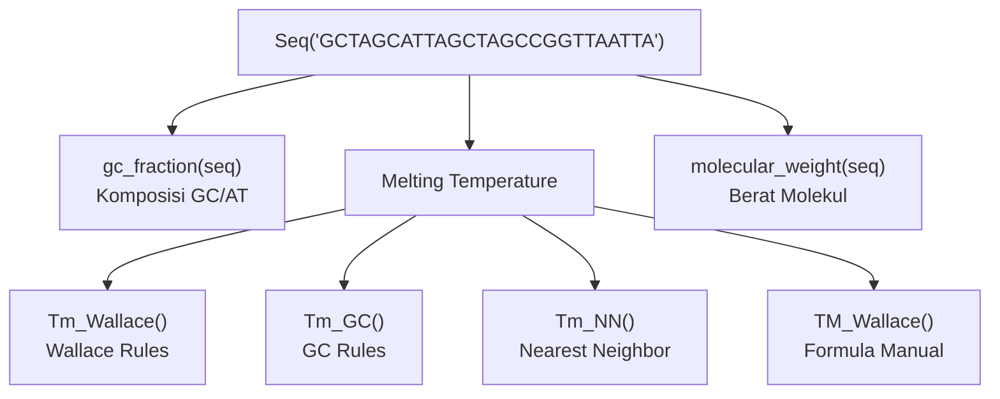

# Analisis Komposisi DNA

**Menghitung komposisi GC/AT, titik leleh (melting temperature), dan berat molekul sekuens DNA menggunakan BioPython.**

---

## Komposisi GC/AT

`gc_fraction()` menghitung proporsi basa **G + C** dalam sekuens. Nilainya berkisar antara 0 hingga 1.

<RunCode
  packages={["biopython"]}
  preamble={`from Bio.SeqUtils import gc_fraction\nfrom Bio.Seq import Seq\nseq = Seq('GCTAGCATTAGCTAGCCGGTTAATTA')`}
>{`gc_composition = gc_fraction(seq)
print(f"GC Composition: {gc_composition*100:.2f}%")

at_composition = 1 - gc_composition
print(f"AT Composition: {at_composition*100:.2f}%")`}</RunCode>

> Komposisi GC penting karena ikatan G–C lebih kuat (3 ikatan hidrogen) dibanding A–T (2 ikatan hidrogen), sehingga mempengaruhi stabilitas termal DNA.

---

## Titik Leleh (Melting Temperature)

**Melting Temperature (Tm)** adalah suhu di mana 50% untai DNA terdenaturasi menjadi rantai tunggal. BioPython menyediakan tiga metode kalkulasi melalui modul `MeltingTemp`:

### 1. Wallace Rules

Metode paling sederhana, akurat untuk sekuens **pendek (≤ 14 bp)**:

$$Tm = 2(A + T) + 4(G + C)$$

<RunCode
  packages={["biopython"]}
  preamble={`from Bio.Seq import Seq\nfrom Bio.SeqUtils import MeltingTemp\nseq = Seq('GCTAGCATTAGCTAGCCGGTTAATTA')`}
>{`mt_wallace = MeltingTemp.Tm_Wallace(seq)
print(f"Melting Temp Wallace: {mt_wallace}")`}</RunCode>

### 2. GC Rules

Metode berbasis persentase GC, lebih akurat untuk sekuens **panjang (> 14 bp)**:

<RunCode
  packages={["biopython"]}
  preamble={`from Bio.Seq import Seq\nfrom Bio.SeqUtils import MeltingTemp\nseq = Seq('GCTAGCATTAGCTAGCCGGTTAATTA')`}
>{`mt_gc = MeltingTemp.Tm_GC(seq)
print(f"Melting Temp GC: {mt_gc}")`}</RunCode>

### 3. Nearest Neighbor (NN) Rules

Metode paling akurat secara termodinamika — mempertimbangkan **interaksi antar pasangan basa tetangga**:

<RunCode
  packages={["biopython"]}
  preamble={`from Bio.Seq import Seq\nfrom Bio.SeqUtils import MeltingTemp\nseq = Seq('GCTAGCATTAGCTAGCCGGTTAATTA')`}
>{`mt_NN = MeltingTemp.Tm_NN(seq)
print(f"Melting Temp NN: {mt_NN}")`}</RunCode>

### Formula Wallace Manual

Implementasi formula Wallace dari awal, mendukung dua rentang panjang sekuens:

<RunCode
  packages={["biopython"]}
  preamble={`from Bio.Seq import Seq\nseq = Seq('GCTAGCATTAGCTAGCCGGTTAATTA')`}
>{`def TM_Wallace(seq):
    count_G = seq.count('G')
    count_C = seq.count('C')
    count_A = seq.count('A')
    count_T = seq.count('T')

    if len(seq) <= 28:
        return 2 * (count_A + count_T) + 4 * (count_C + count_G)
    else:
        return 64.9 + 41 * (count_G + count_C - 16.4) / len(seq)

print(f"Melting Temp Wallace (manual): {TM_Wallace(seq)}")`}</RunCode>

| Metode | Keunggulan | Digunakan untuk |
| ------ | ---------- | --------------- |
| Wallace | Sederhana, cepat | Sekuens pendek (≤ 14 bp) |
| GC | Mudah dihitung | Sekuens panjang, estimasi cepat |
| Nearest Neighbor | Paling akurat | Primer PCR, analisis presisi tinggi |

---

## Berat Molekul (Molecular Weight)

`molecular_weight()` menghitung berat molekul sekuens DNA dalam **g/mol** berdasarkan komposisi basanya:

$$MW = n_A \cdot m_A + n_C \cdot m_C + n_G \cdot m_G + n_T \cdot m_T$$

<RunCode
  packages={["biopython"]}
  preamble={`from Bio.Seq import Seq\nfrom Bio.SeqUtils import molecular_weight\nseq = Seq('GCTAGCATTAGCTAGCCGGTTAATTA')`}
>{`mw = molecular_weight(seq)
print(f"molecular_weight = {mw}")`}</RunCode>

> Nilai berat molekul berguna untuk preparasi larutan DNA dan perhitungan konsentrasi molar (misalnya: nmol/µg, OD₂₆₀).

---

## Kode Lengkap

export const sesi2Files = [
  {
    type: "folder",
    name: "dna-composition",
    children: [
      {
        type: "file",
        name: "sesi2.py",
        lang: "python",
        code: `import Bio
from Bio.SeqUtils import gc_fraction
from Bio.Seq import Seq

seq = Seq('GCTAGCATTAGCTAGCCGGTTAATTA')

# ── Komposisi GC/AT ───────────────────────────────────────────────
gc_composition = gc_fraction(seq)
print(f"GC Composition: {gc_composition*100:.2f}%")

at_composition = 1 - gc_composition
print(f"AT Composition: {at_composition*100:.2f}%")

# ── Titik Leleh (Melting Temperature) ────────────────────────────
from Bio.SeqUtils import MeltingTemp

# Wallace Rules (<= 14 BP)
mt_wallace = MeltingTemp.Tm_Wallace(seq)
print(f"Melting Temp Wallace: {mt_wallace}")

# GC Rules
mt_gc = MeltingTemp.Tm_GC(seq)
print(f"Melting Temp GC: {mt_gc}")

# NN Rules (Nearest Neighbor)
mt_NN = MeltingTemp.Tm_NN(seq)
print(f"Melting Temp NN: {mt_NN}")

# Formula Wallace Manual
def TM_Wallace(seq):
    count_G = seq.count('G')
    count_C = seq.count('C')
    count_A = seq.count('A')
    count_T = seq.count('T')

    if len(seq) <= 28:
        return 2 * (count_A + count_T) + 4 * (count_C + count_G)
    else:
        # TM = 64.9 + 41 x (G + C - 16.4) / N
        return 64.9 + 41 * (count_G + count_C - 16.4) / len(seq)

print(f"Melting Temp Wallace (manual): {TM_Wallace(seq)}")

# ── Berat Molekul (Molecular Weight) ─────────────────────────────
# MW = countA * massA + countC * massC + countG * massG + countT * massT
from Bio.SeqUtils import molecular_weight

print(f"molecular_weight = {molecular_weight(seq)}")`,
      },
    ],
  },
];

<FileExplorer files={sesi2Files} defaultFile="dna-composition/sesi2.py" height={380} />

---

## Ringkasan

| Fungsi | Modul | Deskripsi |
| ------ | ----- | --------- |
| `gc_fraction(seq)` | `Bio.SeqUtils` | Proporsi GC (0–1) |
| `MeltingTemp.Tm_Wallace(seq)` | `Bio.SeqUtils.MeltingTemp` | Tm metode Wallace |
| `MeltingTemp.Tm_GC(seq)` | `Bio.SeqUtils.MeltingTemp` | Tm berbasis % GC |
| `MeltingTemp.Tm_NN(seq)` | `Bio.SeqUtils.MeltingTemp` | Tm Nearest Neighbor (paling akurat) |
| `molecular_weight(seq)` | `Bio.SeqUtils` | Berat molekul (g/mol) |

### Perbandingan Metode Melting Temperature

| Metode | Hasil (contoh 26 bp) | Kompleksitas |
| ------ | -------------------- | ------------ |
| Wallace | 74.0°C | Rendah |
| GC | 54.17°C | Sedang |
| Nearest Neighbor | 55.12°C | Tinggi |

> **Kapan memilih metode?** Untuk desain primer PCR, gunakan **Nearest Neighbor** karena paling akurat secara termodinamika. Wallace cocok untuk estimasi cepat pada oligonukleotida pendek.
