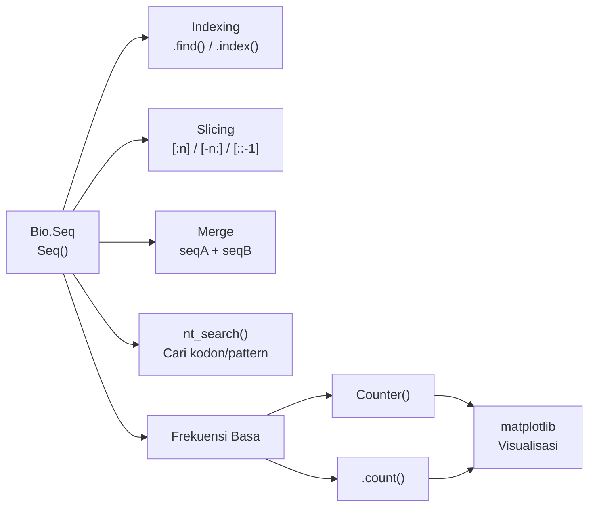

# Analisis Sekuens menggunakan BioPython

**Mempelajari dasar-dasar analisis sekuens DNA menggunakan library BioPython di Python.**

---

## Instalasi

Pastikan BioPython sudah terinstal sebelum memulai:

```bash
pip install biopython
```

---

## Membuat Sekuens

`Bio.Seq` adalah kelas utama di BioPython untuk merepresentasikan urutan nukleotida DNA. Objek `Seq` dapat diperlakukan seperti string Python biasa, namun memiliki metode tambahan khusus analisis biologi.

<RunCode packages={["biopython"]} preamble={`from Bio.Seq import Seq`}>{`seqA = Seq("ATGCATGC")
print(f'Sequence A: {seqA}')`}</RunCode>

---

## Indexing & Pencarian

Untuk menemukan posisi basa tertentu dalam sekuens, gunakan `.find()` atau `.index()`:

| Metode | Perilaku jika tidak ditemukan |
| ------ | ----------------------------- |
| `.find()` | Mengembalikan `-1` |
| `.index()` | Melempar `ValueError` |

<RunCode packages={["biopython"]} preamble={`from Bio.Seq import Seq\nseqA = Seq("ATGCATGC")`}>{`print(f'5th Base: {seqA[4]}')
print(f'.find(): {seqA.find("T")}')
print(f'.index(): {seqA.index("T")}')`}</RunCode>

> Gunakan `.find()` jika kamu tidak yakin apakah pattern ada. Gunakan `.index()` jika kamu yakin ada dan ingin program berhenti jika tidak ditemukan.

---

## Slicing

Mengambil bagian dari sekuens menggunakan notasi `[start:stop:step]`:

<RunCode packages={["biopython"]} preamble={`from Bio.Seq import Seq\nseqA = Seq("ATGCATGC")`}>{`print(seqA)
print(f'First 5 bases: {seqA[:5]}')
print(f'Last 5 bases: {seqA[-5:]}')
print(f'Reversed: {seqA[::-1]}')`}</RunCode>

---

## Menggabungkan Sekuens

Gunakan operator `+` untuk menggabungkan (konkatenasi) dua objek `Seq`:

<RunCode packages={["biopython"]} preamble={`from Bio.Seq import Seq`}>{`seqA = Seq("ATGCATGC")
seqB = Seq("CTGAGATC")

seqC = seqA + seqB
print(f'Sequence C: {seqC}')`}</RunCode>

---

## Menemukan Kodon (`nt_search`)

`nt_search()` dari `Bio.SeqUtils` mengembalikan list berisi **pattern** diikuti **semua indeks** kemunculannya:

<RunCode
  packages={["biopython"]}
  preamble={`from Bio.Seq import Seq\nfrom Bio.SeqUtils import nt_search\nseqA = Seq("ATGCATGC")\nseqB = Seq("CTGAGATC")`}
>{`# Format output: [pattern, index1, index2, ...]
print(nt_search(str(seqA), "ATG"))
print(nt_search(str(seqB), "ATG"))`}</RunCode>

> Perhatikan bahwa `nt_search()` menerima **string biasa**, bukan objek `Seq`. Gunakan `str(seq)` untuk konversi.

---

## Frekuensi Nukleotida

Ada dua cara menghitung frekuensi basa dalam sekuens:

<RunCode
  packages={["biopython"]}
  preamble={`from Bio.Seq import Seq\nfrom collections import Counter\nseqA = Seq("ATGCATGC")`}
>{`# Cara 1: Counter
counter_A = Counter(seqA)
print(counter_A)

# Cara 2: .count()
freq_A = seqA.count('A')
freq_T = seqA.count('T')
freq_G = seqA.count('G')
freq_C = seqA.count('C')
print(freq_A, freq_T, freq_G, freq_C)`}</RunCode>

---

## Visualisasi

Gunakan `matplotlib` untuk memvisualisasikan frekuensi basa sebagai bar chart:

<RunCode
  packages={["biopython", "matplotlib"]}
  preamble={`from Bio.Seq import Seq\nfrom collections import Counter\nimport matplotlib.pyplot as plt\nseqA = Seq("ATGCATGC")\ncounter_A = Counter(seqA)\nfreq_A, freq_T = seqA.count('A'), seqA.count('T')\nfreq_G, freq_C = seqA.count('G'), seqA.count('C')`}
>{`fig, (ax1, ax2) = plt.subplots(1, 2, figsize=(9, 4))
ax1.bar(counter_A.keys(), counter_A.values())
ax1.set_title("Frequency using Counter")
ax2.bar(["A", "T", "G", "C"], [freq_A, freq_T, freq_G, freq_C])
ax2.set_title("Frequency using .count()")
plt.tight_layout()
plt.show()`}</RunCode>

---

## Kode Lengkap

export const sesi1Files = [
  {
    type: "folder",
    name: "sequence-analysis",
    children: [
      {
        type: "file",
        name: "sesi1.py",
        lang: "python",
        code: `from Bio.Seq import Seq

# ── Membuat Sekuens ───────────────────────────────────────────────
seqA = Seq("ATGCATGC")
print(f'Sequence A: {seqA}')

# ── Indexing & Pencarian ──────────────────────────────────────────
print(f'5th Base: {seqA[4]}')

# Cara 1: .find() -> return -1 jika tidak ketemu
print(f'.find(): {seqA.find("T")}')

# Cara 2: .index() -> raise error jika tidak ketemu
print(f'.index(): {seqA.index("T")}')

# ── Slicing ───────────────────────────────────────────────────────
print(seqA)
print(f'First 5 bases: {seqA[:5]}')
print(f'Last 5 bases: {seqA[-5:]}')
print(f'Reversed: {seqA[::-1]}')

# ── Merge / Gabungkan Sekuens ─────────────────────────────────────
seqB = Seq("CTGAGATC")
seqC = seqA + seqB
print(f'Sequence A: {seqA}')
print(f'Sequence B: {seqB}')
print(f'Sequence C: {seqC}')

# ── Menemukan Kodon ───────────────────────────────────────────────
from Bio.SeqUtils import nt_search
print(f"ATG in Sequence A: {nt_search(str(seqA), 'ATG')}")
print(f"ATG in Sequence B: {nt_search(str(seqB), 'ATG')}")

# ── Frekuensi Nukleotida ──────────────────────────────────────────
from collections import Counter

counter_A = Counter(seqA)
print(f"Frequency Sequence A: {counter_A}")

freq_A = seqA.count('A')
freq_T = seqA.count('T')
freq_G = seqA.count('G')
freq_C = seqA.count('C')
print(freq_A, freq_T, freq_G, freq_C)

# ── Visualisasi ───────────────────────────────────────────────────
import matplotlib.pyplot as plt

plt.bar(counter_A.keys(), counter_A.values())
plt.title("Frequency Sequence A using Counter")
plt.show()

plt.bar(["A", "T", "G", "C"], [freq_A, freq_T, freq_G, freq_C])
plt.title("Frequency Sequence A using .count()")
plt.show()`,
      },
      {
        type: "file",
        name: "sesi1_latihan.py",
        lang: "python",
        code: `from Bio.Seq import Seq
from collections import Counter
import matplotlib.pyplot as plt

seqA = Seq("AGCTTGCAGCGTCCGTTAGCTCGAGTCCAGGACGTTAGTCCTGCAGTC")
seqB = Seq("CAGTAAGTTGCCGTTAGCGCGTAGTGCCAGTAAGCGGCTCGTTAGTGG")

# 1. Panjang kedua sekuens
print(f'Length of sequence A: {len(seqA)}')
print(f'Length of sequence B: {len(seqB)}')

# 2. Jumlah kemunculan CGC pada kedua sekuens
total = seqA.count('CGC') + seqB.count('CGC')
print(f'Total CGC = {total}')

# 3. Kemunculan pertama CAGTC
print(f"First occurrence in sequence A: {seqA.find('CAGTC')}")
print(f"First occurrence in sequence B: {seqB.find('CAGTC')}")

# 4. Gabungkan 15 basa pertama seqA + 10 basa terakhir seqB
seqC = seqA[:15] + seqB[-10:]
print(f"Sequence C: {seqC}")

# 5. Balik seqC
print(f"Reversed: {seqC[::-1]}")

# 6. Frekuensi + Visualisasi
counter_A = Counter(seqA)
counter_B = Counter(seqB)
counter_C = Counter(seqC)

fig, axs = plt.subplots(1, 3, figsize=(16, 8))
axs = axs.flatten()

axs[0].bar(counter_A.keys(), counter_A.values())
axs[0].set_title("Frequency Sequence A")

axs[1].bar(counter_B.keys(), counter_B.values())
axs[1].set_title('Frequency Sequence B')

axs[2].bar(counter_C.keys(), counter_C.values())
axs[2].set_title('Frequency Sequence C')

plt.tight_layout()
plt.show()`,
      },
    ],
  },
];

<FileExplorer files={sesi1Files} defaultFile="sequence-analysis/sesi1.py" height={440} />

---

## Latihan

Diberikan dua sekuens berikut (masing-masing 48 bp):

```python
seqA = Seq("AGCTTGCAGCGTCCGTTAGCTCGAGTCCAGGACGTTAGTCCTGCAGTC")
seqB = Seq("CAGTAAGTTGCCGTTAGCGCGTAGTGCCAGTAAGCGGCTCGTTAGTGG")
```

Kerjakan soal-soal berikut:

1. Hitung panjang masing-masing sekuens
2. Hitung **total** kemunculan motif `CGC` pada kedua sekuens digabung
3. Temukan kemunculan pertama motif `CAGTC` di setiap sekuens
4. Buat sekuens baru: **15 basa pertama** dari seqA + **10 basa terakhir** dari seqB
5. Balikkan urutan sekuens baru tersebut
6. Hitung frekuensi basa dan visualisasikan dengan bar chart

Klik tab `sesi1_latihan.py` di file explorer di atas untuk melihat solusinya.

---

## Ringkasan



| Fungsi | Deskripsi |
| ------ | --------- |
| `Seq()` | Membuat objek sekuens DNA |
| `seqA[i]` | Akses basa ke-i (0-based) |
| `.find(pat)` | Cari posisi pattern (return `-1` jika tidak ada) |
| `.index(pat)` | Cari posisi pattern (raise error jika tidak ada) |
| `nt_search(str, pat)` | Cari semua posisi pattern (dari BioPython) |
| `seq[start:stop]` | Slicing sekuens |
| `seq[::-1]` | Membalik sekuens |
| `seqA + seqB` | Menggabungkan sekuens |
| `Counter(seq)` | Frekuensi semua basa sekaligus |
| `.count(base)` | Frekuensi satu basa |
