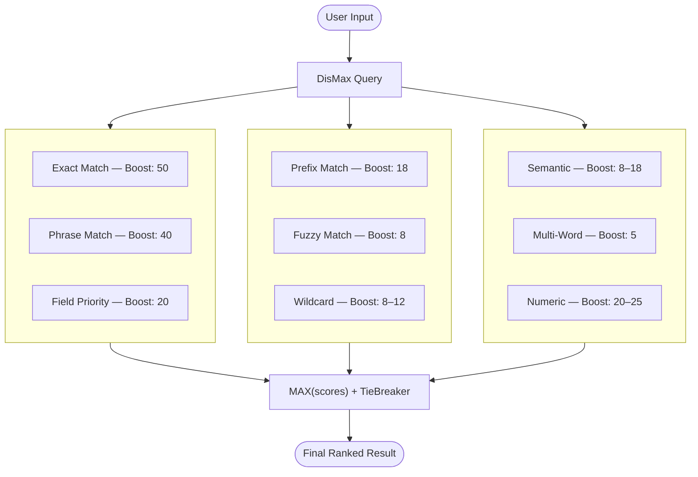
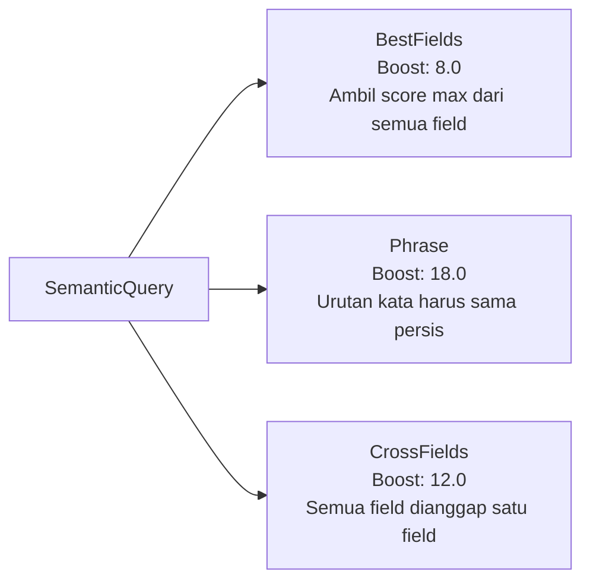
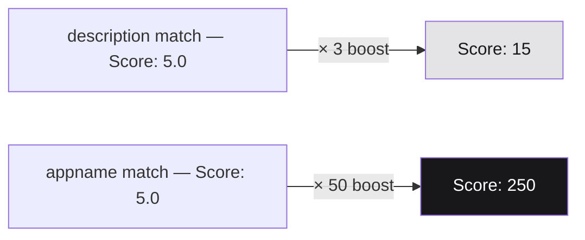
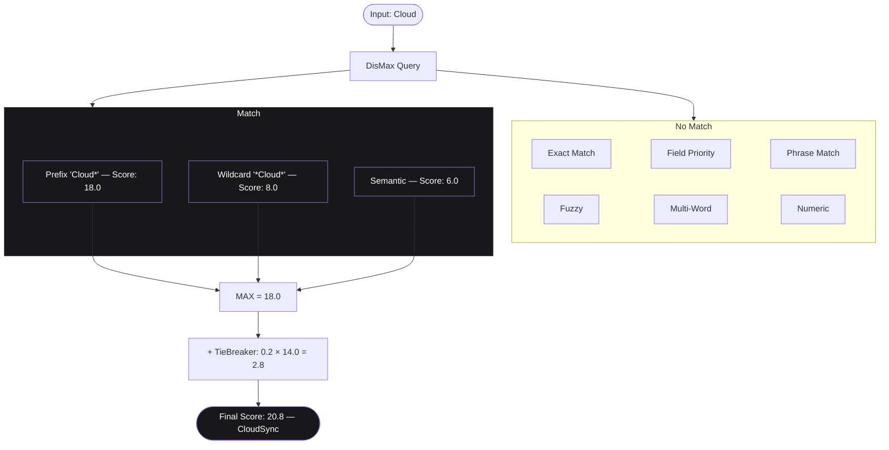

# Advanced Search

Sistem pencarian ini menggunakan **multi-strategy approach** — bukan hanya satu query, melainkan serangkaian strategi yang bekerja bersama untuk menghasilkan hasil yang paling relevan. Setiap strategi memiliki bobot (boost) berbeda yang memengaruhi skor akhir dokumen.



---

## Exact Match

**Tujuan:** Mencari dokumen yang memiliki teks **100% identik** dengan keyword yang dimasukkan.

Ini adalah strategi paling ketat. Field harus mengandung **nilai yang persis sama** dengan keyword — tidak lebih, tidak kurang.

| Keyword | Field Value | Result |
|---------|-------------|--------|
| `"CloudSync"` | `appname = "CloudSync"` | Match |
| `"CloudSync"` | `appname = "Sistem CloudSync"` | No Match |

---

## Field Priority

**Tujuan:** Memberikan **bobot lebih tinggi** pada match yang ditemukan di field-field penting seperti `title`, `topic`, dan `appname`.

Keyword yang ditemukan di judul jauh lebih relevan dibandingkan keyword yang kebetulan muncul di deskripsi panjang.

| Keyword | Match Location | Score |
|---------|----------------|-------|
| `"Dashboard"` | `title = "Analytics Dashboard"` | Tinggi |
| `"Dashboard"` | `description = "...menggunakan dashboard untuk..."` | Rendah |

---

## Phrase Match

**Tujuan:** Mencari keyword multi-kata dengan **urutan kata yang sama persis** (atau mendekati).

Berguna ketika urutan kata dalam keyword memiliki makna berbeda jika dibalik.

| Keyword | Field Value | Result |
|---------|-------------|--------|
| `"User Management"` | `"User Management System"` | Match (urutan sama) |
| `"User Management"` | `"Management of User"` | Lower Score (urutan berbeda) |

---

## Prefix Match

**Tujuan:** Mendukung **autocomplete** — mencocokkan kata yang dimulai dengan awalan tertentu.

:::note
Prefix match hanya bekerja dari awal kata. Kata yang mengandung keyword di tengah tidak akan ter-match.
:::

| Keyword | Field Value | Result |
|---------|-------------|--------|
| `"Dash"` | `"Dashboard"` | Match |
| `"Dash"` | `"Dashboard Analytics"` | Match |
| `"Dash"` | `"New Dashboard"` | No Match (tidak diawali "Dash") |

---

## Fuzzy Match

**Tujuan:** Memberikan **toleransi terhadap typo** berdasarkan edit distance — jumlah operasi (insert, delete, replace) yang diperlukan untuk mengubah satu kata menjadi kata lain.

| Keyword (typo) | Match | Edit Distance |
|----------------|-------|---------------|
| `"Dasboard"` | `"Dashboard"` | 1 (kurang `h`) |
| `"autentication"` | `"authentication"` | 1 (kurang `h`) |
| `"manajemen"` | `"management"` | ~4 (beda bahasa) |

---

## Wildcard Match

**Tujuan:** Mencari keyword yang muncul **di posisi mana saja** dalam sebuah kata atau teks menggunakan pola `*keyword*`.

| Keyword | Pattern | Match |
|---------|---------|-------|
| `"cloud"` | `*cloud*` | `"CloudSync"` |
| `"cloud"` | `*cloud*` | `"cloud storage"` |

---

## Multi Word Analysis

**Tujuan:** Memecah keyword multi-kata menjadi kata-kata individual, lalu mencari dokumen yang mengandung **minimal 70% dari kata-kata tersebut**.

```
Keyword: "User Account Management"
Words:   ["User", "Account", "Management"]
```

| Document | Words Found | Coverage | Result |
|----------|-------------|----------|--------|
| `"User Account"` | 2/3 | 67% | No Match |
| `"User Management System"` | 2/3 | 67% | No Match |
| `"Account Management App"` | 2/3 | 67% | No Match |
| `"User Account Management"` | 3/3 | 100% | Match |

---

## Semantic Query

**Tujuan:** Menggabungkan beberapa field sekaligus dengan bobot berbeda dalam satu query. Dibagi menjadi tiga tipe:



### BestFields — Boost: 8.0

Mengambil **skor tertinggi** dari semua field yang dicari. Field dengan relevansi paling tinggi yang menentukan skor akhir.

```
Keyword: "Dashboard"

Document 1:
  title: "Analytics Dashboard"            → Score: 12.0 × 8.0 = 96.0
  description: "sistem untuk monitoring"  → Score: 0
  → Final = MAX(96.0, 0) = 96.0

Document 2:
  title: "New Application"                → Score: 0
  description: "menggunakan dashboard..."  → Score: 3.0 × 8.0 = 24.0
  → Final = MAX(0, 24.0) = 24.0

Rank: Document 1 (96) > Document 2 (24)
```

### Phrase — Boost: 18.0

Mencari **urutan kata yang sama** di semua field. Mendapat boost tertinggi karena tingkat presisi paling tinggi.

```
Keyword: "User Management"

Document 1 — title: "User Management System"
  → Match (urutan sama) → Score: 15.0 × 18.0 = 270.0

Document 2 — title: "Management of User"
  → No Match (urutan berbeda) → Score: 0

Document 3 — appname: "User Management App"
  → Match → Score: 14.0 × 18.0 = 252.0
```

### CrossFields — Boost: 12.0

Memperlakukan **semua field sebagai satu field besar**. Memungkinkan keyword yang tersebar di field berbeda tetap ter-match.

```
Keyword: "User Analytics"

Document 1:
  title: "Analytics Overview"     ← ada "Analytics"
  appname: "User Dashboard"       ← ada "User"
  → Match (kata ketemu di field berbeda) → Score: 12.0

Document 2:
  title: "New System"
  appname: "Data App"
  → No Match
```

---

## Numeric Field Query

**Boost: 25.0 (exact) / 20.0 (string)**

**Tujuan:** Mencari nilai numerik atau ID secara exact match. Memastikan ketika user memasukkan angka seperti ID atau kode, hasil yang tepat langsung muncul di posisi teratas.

| Keyword | Field | Result |
|---------|-------|--------|
| `"42"` | `id = 42` (integer) | Match |
| `"42"` | `id = "42"` (string) | Match |

---

## Boost Strategy

### Kenapa Perlu Boost?

Tanpa boost, semua field dianggap sama pentingnya — padahal match di `appname` jauh lebih relevan daripada match di `description`.



### Boost Hierarchy

| Priority | Strategy | Boost |
|----------|----------|-------|
| 1 | Exact Match `.keyword` | 50 |
| 2 | Phrase Match | 40 |
| 3 | Numeric Exact | 25 |
| 4 | Field Priority High / Numeric String | 20 |
| 5 | Prefix / Semantic Phrase | 18 |
| 6 | Phrase with Slop | 16 |
| 7 | Field Priority Medium / Wildcard prefix | 12 |
| 8 | Fuzzy / Wildcard contains / Semantic BestFields | 8 |
| 9 | Multi-Word | 5 |
| 10 | Low Priority Fields | 1.5 |

---

## Contoh Alur Query: Input `"Cloud"`


