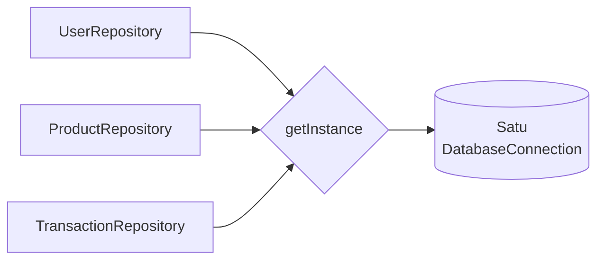
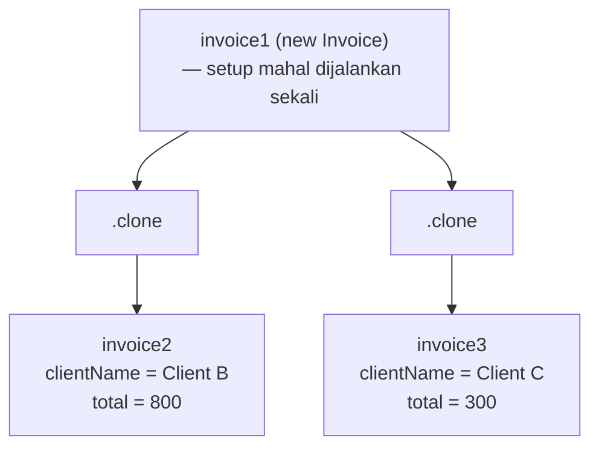

# Creational Design Patterns

**Design pattern adalah solusi efektif untuk masalah yang berulang dalam pengembangan perangkat lunak.**

Sebuah pattern bukan kode yang langsung di-copy-paste — melainkan blueprint yang perlu disesuaikan dengan konteks spesifikmu. Satu pattern bisa memecahkan beberapa masalah, tapi tidak setiap masalah membutuhkan pattern.

> Sumber: [Refactoring Guru](https://refactoring.guru/design-patterns)

---

## Singleton

**Memastikan sebuah kelas hanya memiliki satu instansi, dan menyediakan titik akses global ke instansi tersebut.**

<DiffBlock
  lang="typescript"
  beforeTitle="Masalah — Banyak instansi"
  afterTitle="Solusi — Satu instansi bersama"
  before={`class DatabaseConnection {
  constructor() {
    if (this.isConnectionFull())
      throw Error("Connection pool penuh");
    this.init(); // setup mahal, dijalankan setiap kali
  }
}

// Setiap repository membuat koneksinya sendiri
const userRepo    = new UserRepository();    // koneksi baru
const productRepo = new ProductRepository(); // koneksi baru
const txRepo      = new TransactionRepository(); // koneksi baru`}
  after={`export class DatabaseConnection {
  private static _instance: DatabaseConnection | null = null;
  private static maxConnectionPool: number = 2;
  private static currentConnectionPool: number = 0;

  private constructor() {
    if (this.isConnectionFull())
      throw Error("Connection pool penuh");
    this.init();
  }

  public static getInstance(): DatabaseConnection {
    if (this._instance === null) {
      this._instance = new DatabaseConnection();
    }
    return this._instance; // selalu mengembalikan instansi yang sama
  }
}

// Semua repository berbagi koneksi yang sama
const userRepo    = new UserRepository();    // berbagi
const productRepo = new ProductRepository(); // berbagi
const txRepo      = new TransactionRepository(); // berbagi`}
/>

### Kapan Digunakan

- Kamu butuh tepat satu instansi yang dibagi ke seluruh aplikasi (misal: koneksi DB, config, logger)
- Membuat objeknya membutuhkan proses yang mahal dan sebaiknya hanya dilakukan sekali

---

## Builder

**Membangun objek yang kompleks secara bertahap, memisahkan proses konstruksi dari objek akhirnya.**

<DiffBlock
  lang="typescript"
  beforeTitle="Masalah — Constructor yang membingungkan"
  afterTitle="Solusi — Builder yang bisa di-chain"
  before={`// Susah dibaca — argumen apa saja ini?
const query = new Query(
  "users",
  ["id", "username"],
  ["age > 18"]
);`}
  after={`export class QueryBuilder implements IQueryBuilder {
  private _table: string;
  private _selectFields: string[];
  private _whereClauses: string[];

  constructor(table: string, selectFields: string[] = ["*"]) {
    this._table = table;
    this._selectFields = selectFields;
    this._whereClauses = [];
  }

  setTable(table: string): IQueryBuilder {
    this._table = table;
    return this; // memungkinkan method chaining
  }

  setSelectFields(fields: string[]): IQueryBuilder {
    this._selectFields = fields;
    return this;
  }

  setWhereClauses(clauses: string[]): IQueryBuilder {
    this._whereClauses = clauses;
    return this;
  }

  get(): Query {
    return new Query(
      this._table,
      this._selectFields,
      this._whereClauses
    );
  }
}

// Penggunaan — mudah dibaca, mudah dikembangkan
const query = new QueryBuilder("users", ["id", "username", "email"])
  .setWhereClauses(["age > 18"])
  .get();`}
/>

### Kapan Digunakan

- Membangun objek dengan banyak konfigurasi opsional
- Kamu ingin proses konstruksi yang mudah dibaca, langkah demi langkah
- Proses konstruksi yang sama harus bisa menghasilkan representasi yang berbeda

---

## Prototype

**Membuat objek baru dengan mengkloning objek yang sudah ada, daripada membangun dari awal.**

<DiffBlock
  lang="typescript"
  beforeTitle="Masalah — Setup mahal diulang terus"
  afterTitle="Solusi — Clone lalu modifikasi"
  before={`// Setiap invoice menjalankan inisialisasi yang berat
const invoice1 = new Invoice(
  "ABC Corp", logo, footer,
  new Date(), "Client A", [...], 1200
);
// "Menginisialisasi invoice baru..."
// "Memuat template layout..."
// "Memuat logo dan footer perusahaan..."
// "Mengatur style dan font..."

const invoice2 = new Invoice(
  "ABC Corp", logo, footer,
  new Date(), "Client B", [...], 800
);
// Setup yang sama diulang lagi...

const invoice3 = new Invoice(
  "ABC Corp", logo, footer,
  new Date(), "Client C", [...], 300
);
// Dan lagi...`}
  after={`export class Invoice implements IClonable {
  // ... properti

  clone(): Invoice {
    return new Invoice(
      this._companyName,
      this._logo,
      this._footer,
      this._date,
      this._clientName,
      this._items,
      this._totalAmount,
    );
  }
}

// Setup berat hanya dijalankan sekali
const invoice1 = new Invoice(
  "ABC Corp", logo, footer, new Date(),
  "Client A", ["Laptop", "Mouse"], 1200
);

// Clone melewati setup — hanya ubah yang berbeda
const invoice2 = invoice1.clone();
invoice2.clientName  = "Client B";
invoice2.items       = ["Monitor", "Keyboard"];
invoice2.totalAmount = 800;

const invoice3 = invoice1.clone();
invoice3.clientName  = "Client C";
invoice3.items       = ["Kursi Meja"];
invoice3.totalAmount = 300;`}
/>

### Kapan Digunakan

- Pembuatan objek membutuhkan proses yang mahal (setup berat, panggilan DB, loading file)
- Kamu butuh banyak objek serupa yang hanya berbeda di beberapa properti
- Kamu ingin menghindari subclassing hanya untuk mendapatkan state awal yang berbeda

---

## Ringkasan

| Pattern       | Tujuan                                            | Mekanisme Utama                       |
| ------------- | ------------------------------------------------- | ------------------------------------- |
| **Singleton** | Hanya satu instansi, dibagi secara global         | Constructor private + `getInstance()` |
| **Builder**   | Membangun objek kompleks secara bertahap          | Method berantai + `get()`             |
| **Prototype** | Mengkloning objek yang ada daripada membuatnya    | Method `clone()`                      |
