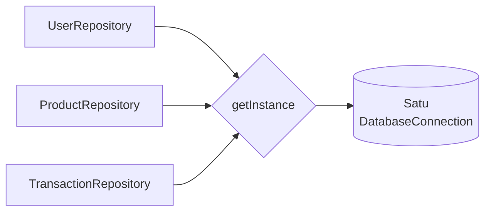
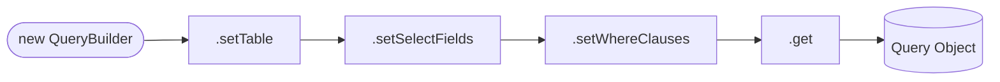
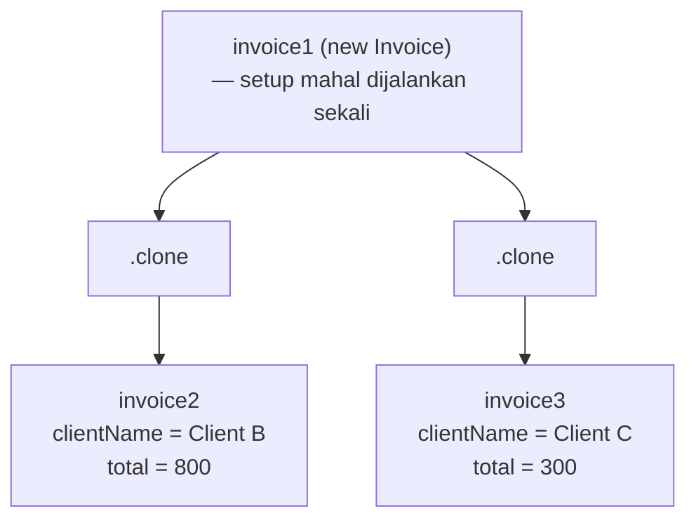

# Creational Design Patterns

**Design pattern adalah solusi efektif untuk masalah yang berulang dalam pengembangan perangkat lunak.**

Sebuah pattern bukan kode yang langsung di-copy-paste — melainkan blueprint yang perlu disesuaikan dengan konteks spesifikmu. Satu pattern bisa memecahkan beberapa masalah, tapi tidak setiap masalah membutuhkan pattern.

> Sumber: [Refactoring Guru](https://refactoring.guru/design-patterns)

---

## Singleton

**Memastikan sebuah kelas hanya memiliki satu instansi, dan menyediakan titik akses global ke instansi tersebut.**

export const singletonFiles = [
  {
    type: "folder",
    name: "src",
    children: [
      {
        type: "folder",
        name: "problem1-singleton",
        children: [
          {
            type: "file",
            name: "databaseConnection.before.ts",
            lang: "typescript",
            code: `function sleep(ms: number) {
  return new Promise((resolve) => setTimeout(resolve, ms));
}

export class DatabaseConnection {
  private static maxConnectionPool: number = 2;
  private static currentConnectionPool: number = 0;

  constructor() {
    if (this.isConnectionFull()) throw Error("Connection pool is full");
    this.init();
  }

  private async init() {
    console.log("Starting connection...");
    console.log("Connecting to database ...");
    console.log("✓ Connection created");
    this.increaseCurrentConnnectionPool();
  }

  private increaseCurrentConnnectionPool() {
    DatabaseConnection.currentConnectionPool++;
  }

  private isConnectionFull(): boolean {
    return (
      DatabaseConnection.currentConnectionPool ===
      DatabaseConnection.maxConnectionPool
    );
  }
}`,
          },
          {
            type: "file",
            name: "databaseConnection.ts",
            lang: "typescript",
            code: `function sleep(ms: number) {
  return new Promise((resolve) => setTimeout(resolve, ms));
}

export class DatabaseConnection {
  private static maxConnectionPool: number = 2;
  private static currentConnectionPool: number = 0;
  private static _instance: DatabaseConnection | null = null;

  private constructor() {
    if (this.isConnectionFull()) throw Error("Connection pool is full");
    this.init();
  }

  // Intinya ProductRepository, TransactionRepository, UserRepository langsung ambil instance
  // tanpa harus buat instance baru lagi, karena sudah ada instance yang dibuat di constructor DatabaseConnection
  public static getInstance(): DatabaseConnection {
    if (this._instance === null) {
      this._instance = new DatabaseConnection();
    }
    return this._instance;
  }

  private async init() {
    console.log("Starting connection...");
    console.log("Connecting to database ...");
    console.log("✓ Connection created");
    this.increaseCurrentConnnectionPool();
  }

  private increaseCurrentConnnectionPool() {
    DatabaseConnection.currentConnectionPool++;
  }

  private isConnectionFull(): boolean {
    return (
      DatabaseConnection.currentConnectionPool ===
      DatabaseConnection.maxConnectionPool
    );
  }
}`,
          },
          {
            type: "file",
            name: "userRepository.before.ts",
            lang: "typescript",
            code: `import { DatabaseConnection } from "./databaseConnection";

export class UserRepository {
  private _db: DatabaseConnection;

  constructor() {
    this._db = new DatabaseConnection(); // membuat koneksi baru setiap kali
  }

  public getData() {
    return [
      { id: 1, username: "user1" },
      { id: 2, username: "user2" },
      { id: 3, username: "user3" },
    ];
  }
}`,
          },
          {
            type: "file",
            name: "userRepository.ts",
            lang: "typescript",
            code: `import { DatabaseConnection } from "./databaseConnection";

export class UserRepository {
  private _db: DatabaseConnection;

  constructor() {
    this._db = DatabaseConnection.getInstance(); // berbagi satu koneksi
  }

  public getData() {
    return [
      { id: 1, username: "user1" },
      { id: 2, username: "user2" },
      { id: 3, username: "user3" },
    ];
  }
}`,
          },
          {
            type: "file",
            name: "productRepository.before.ts",
            lang: "typescript",
            code: `import { DatabaseConnection } from "./databaseConnection";

export class ProductRepository {
  private _db: DatabaseConnection;

  constructor() {
    this._db = new DatabaseConnection(); // membuat koneksi baru setiap kali
  }

  public getData() {
    return [
      { id: 1, name: "product1" },
      { id: 2, name: "product2" },
      { id: 3, name: "product3" },
    ];
  }
}`,
          },
          {
            type: "file",
            name: "productRepository.ts",
            lang: "typescript",
            code: `import { DatabaseConnection } from "./databaseConnection";

export class ProductRepository {
  private _db: DatabaseConnection;

  constructor() {
    this._db = DatabaseConnection.getInstance(); // berbagi satu koneksi
  }

  public getData() {
    return [
      { id: 1, name: "product1" },
      { id: 2, name: "product2" },
      { id: 3, name: "product3" },
    ];
  }
}`,
          },
          {
            type: "file",
            name: "transactionRepository.before.ts",
            lang: "typescript",
            code: `import { DatabaseConnection } from "./databaseConnection";

export class TransactionRepository {
  private _db: DatabaseConnection;

  constructor() {
    this._db = new DatabaseConnection(); // membuat koneksi baru setiap kali
  }

  public getData() {
    return [
      { user_id: 1, products: [{ product_id: 1, name: "product1" }, { product_id: 2, name: "product2" }] },
      { user_id: 2, products: [{ product_id: 2, name: "product2" }, { product_id: 3, name: "product3" }] },
      { user_id: 3, products: [{ product_id: 1, name: "product1" }, { product_id: 3, name: "product3" }] },
    ];
  }
}`,
          },
          {
            type: "file",
            name: "transactionRepository.ts",
            lang: "typescript",
            code: `import { DatabaseConnection } from "./databaseConnection";

export class TransactionRepository {
  private _db: DatabaseConnection;

  constructor() {
    this._db = DatabaseConnection.getInstance(); // berbagi satu koneksi
  }

  public getData() {
    return [
      { user_id: 1, products: [{ product_id: 1, name: "product1" }, { product_id: 2, name: "product2" }] },
      { user_id: 2, products: [{ product_id: 2, name: "product2" }, { product_id: 3, name: "product3" }] },
      { user_id: 3, products: [{ product_id: 1, name: "product1" }, { product_id: 3, name: "product3" }] },
    ];
  }
}`,
          },
          {
            type: "file",
            name: "demo.ts",
            lang: "typescript",
            code: `import { ProductRepository } from "./productRepository";
import { TransactionRepository } from "./transactionRepository";
import { UserRepository } from "./userRepository";

export function runProblem1() {
  const userRepository: UserRepository = new UserRepository();
  console.log("USER");
  console.log(userRepository.getData());
  console.log("=".repeat(100));

  const productRepository: ProductRepository = new ProductRepository();
  console.log("PRODUCT");
  console.log(productRepository.getData());
  console.log("=".repeat(100));

  const transactionRepository: TransactionRepository = new TransactionRepository();
  console.log("TRANSACTION");
  console.log(transactionRepository.getData());
  console.log("=".repeat(100));

  // Request -> make the database shared across the repositories
}`,
          },
        ],
      },
    ],
  },
];

<FileExplorer files={singletonFiles} defaultFile="src/problem1-singleton/databaseConnection.ts" height={420} />

<DiffBlock
  lang="typescript"
  beforeTitle="Masalah — Setiap repository membuat koneksi baru"
  afterTitle="Solusi — Semua repository berbagi satu koneksi"
  before={`export class DatabaseConnection {
  private static maxConnectionPool: number = 2;
  private static currentConnectionPool: number = 0;

  constructor() { // constructor PUBLIC — bisa dibuat berkali-kali
    if (this.isConnectionFull()) throw Error("Connection pool is full");
    this.init();
  }
  // ...
}

// ❌ Setiap repository membuat koneksi barunya sendiri
export class UserRepository {
  private _db: DatabaseConnection;
  constructor() {
    this._db = new DatabaseConnection(); // koneksi baru
  }
}

export class ProductRepository {
  private _db: DatabaseConnection;
  constructor() {
    this._db = new DatabaseConnection(); // koneksi baru lagi
  }
}`}
  after={`export class DatabaseConnection {
  private static _instance: DatabaseConnection | null = null;

  private constructor() { // constructor PRIVATE — tidak bisa dibuat dari luar
    if (this.isConnectionFull()) throw Error("Connection pool is full");
    this.init();
  }

  public static getInstance(): DatabaseConnection {
    if (this._instance === null) {
      this._instance = new DatabaseConnection();
    }
    return this._instance; // selalu mengembalikan instansi yang sama
  }
  // ...
}

// ✅ Semua repository berbagi satu koneksi
export class UserRepository {
  private _db: DatabaseConnection;
  constructor() {
    this._db = DatabaseConnection.getInstance();
  }
}

export class ProductRepository {
  private _db: DatabaseConnection;
  constructor() {
    this._db = DatabaseConnection.getInstance();
  }
}`}
/>

### Kapan Digunakan

- Kamu butuh tepat satu instansi yang dibagi ke seluruh aplikasi (misal: koneksi DB, config, logger)
- Membuat objeknya membutuhkan proses yang mahal dan sebaiknya hanya dilakukan sekali

---

## Builder

**Membangun objek yang kompleks secara bertahap, memisahkan proses konstruksi dari objek akhirnya.**

export const builderFiles = [
  {
    type: "folder",
    name: "src",
    children: [
      {
        type: "folder",
        name: "problem2-builder",
        children: [
          {
            type: "file",
            name: "iQueryBuilder.new.ts",
            lang: "typescript",
            code: `// Ini File Baru
import { Query } from "./query";

export interface IQueryBuilder {
  setTable(table: string): IQueryBuilder;
  setSelectFields(fields: string[]): IQueryBuilder;
  setWhereClauses(clauses: string[]): IQueryBuilder;

  // Kenapa return IQueryBuilder?
  // Agar kita bisa chaining method, contoh:
  // const query = new QueryBuilder()
  //   .setTable("users")
  //   .setSelectFields(["id", "username"])
  //   .setWhereClauses(["id = 1"])
  //   .get();

  get(): Query;
}`,
          },
          {
            type: "file",
            name: "query.ts",
            lang: "typescript",
            code: `export class Query {
  private _table: string;
  private _selectFields: string[];
  private _whereClauses: string[];

  constructor(table: string, selectFields: string[], whereClauses: string[]) {
    this._table = table;
    this._selectFields = selectFields;
    this._whereClauses = whereClauses;
  }

  // Getters
  get table(): string { return this._table; }
  get selectFields(): string[] { return this._selectFields; }
  get whereClauses(): string[] { return this._whereClauses; }

  // Setters
  set table(value: string) { this._table = value; }
  set selectFields(fields: string[]) { this._selectFields = fields; }
  set whereClauses(clauses: string[]) { this._whereClauses = clauses; }

  public print(): void {
    console.log("=== QUERY ===");
    console.log("Table:", this._table);
    console.log("Select:", this._selectFields.join(", ") || "*");
    console.log("Where:", this._whereClauses.join(" AND ") || "None");
    console.log("=".repeat(50));
  }
}`,
          },
          {
            type: "file",
            name: "QueryBuilder.ts",
            lang: "typescript",
            code: `// Ini file baru
import { IQueryBuilder } from "./iQueryBuilder.new";
import { Query } from "./query";

export class QueryBuilder implements IQueryBuilder {
  private _table: string;
  private _selectFields: string[];
  private _whereClauses: string[];

  constructor(table: string, selectFields: string[] = ["*"]) {
    this._table = table;
    this._selectFields = selectFields;
    this._whereClauses = [];
  }

  setTable(table: string): IQueryBuilder {
    this._table = table;
    return this;
  }

  setSelectFields(fields: string[]): IQueryBuilder {
    this._selectFields = fields;
    return this;
  }

  setWhereClauses(clauses: string[]): IQueryBuilder {
    this._whereClauses = clauses;
    return this;
  }

  get(): Query {
    return new Query(this._table, this._selectFields, this._whereClauses);
  }
}`,
          },
          {
            type: "file",
            name: "demo.before.ts",
            lang: "typescript",
            code: `import { Query } from "./query";

export function runProblem2() {
  const query = new Query("users", ["id", "username", "email"], []);

  query.print();

  // You can also modify table
  query.table = "";
  query.print();

  // Request -> make the query object is immutable also can have optional query settings
}`,
          },
          {
            type: "file",
            name: "demo.ts",
            lang: "typescript",
            code: `import { Query } from "./query";
import { QueryBuilder } from "./QueryBuilder";

export function runProblem2() {
  const query = new QueryBuilder("users", ["id", "username", "email"])
    .setWhereClauses(["age > 18"])
    .get();

  query.print();

  // You can also modify table
  //   query.table = "";
  query.print();

  // Request -> make the query object is immutable also can have optional query settings
}`,
          },
        ],
      },
    ],
  },
];

<FileExplorer files={builderFiles} defaultFile="src/problem2-builder/QueryBuilder.ts" height={420} />

<DiffBlock
  lang="typescript"
  beforeTitle="Masalah — Constructor yang membingungkan"
  afterTitle="Solusi — Builder yang bisa di-chain"
  before={`import { Query } from "./query";

// Susah dibaca — argumen apa saja ini?
const query = new Query("users", ["id", "username", "email"], []);

query.print();

// ❌ Object bisa dimodifikasi langsung dari luar
query.table = "";
query.print();`}
  after={`import { QueryBuilder } from "./QueryBuilder";

// Mudah dibaca — setiap langkah jelas tujuannya
const query = new QueryBuilder("users", ["id", "username", "email"])
  .setWhereClauses(["age > 18"])
  .get();

query.print();

// ✅ Object tidak bisa dimodifikasi sembarangan
// query.table = ""; // tidak perlu lagi`}
/>

### Kapan Digunakan

- Membangun objek dengan banyak konfigurasi opsional
- Kamu ingin proses konstruksi yang mudah dibaca, langkah demi langkah
- Proses konstruksi yang sama harus bisa menghasilkan representasi yang berbeda

---

## Prototype

**Membuat objek baru dengan mengkloning objek yang sudah ada, daripada membangun dari awal.**

export const prototypeFiles = [
  {
    type: "folder",
    name: "src",
    children: [
      {
        type: "folder",
        name: "problem3-prototype",
        children: [
          {
            type: "file",
            name: "iClonable.new.ts",
            lang: "typescript",
            code: `// Ini file baru
import { Invoice } from "./invoice";

export interface IClonable {
  clone(): Invoice;
}`,
          },
          {
            type: "file",
            name: "invoice.before.ts",
            lang: "typescript",
            code: `export class Invoice {
  private _companyName: string;
  private _logo: string;
  private _footer: string;
  private _date: Date;
  private _clientName: string;
  private _items: string[];
  private _totalAmount: number;

  constructor(
    companyName: string, logo: string, footer: string,
    date: Date, clientName: string, items: string[], totalAmount: number
  ) {
    console.log("Initializing new invoice...");
    console.log("Loading invoice layout template...");
    console.log("Loading company logo and footer...");
    console.log("Setting up styles and fonts...");
    console.log("✓ Invoice base setup complete.\\n");

    this._companyName = companyName;
    this._logo = logo;
    this._footer = footer;
    this._date = date;
    this._clientName = clientName;
    this._items = items;
    this._totalAmount = totalAmount;
  }

  // Getters & Setters
  get clientName(): string { return this._clientName; }
  get items(): string[] { return this._items; }
  get totalAmount(): number { return this._totalAmount; }

  set clientName(value: string) { this._clientName = value; }
  set items(value: string[]) { this._items = value; }
  set totalAmount(value: number) { this._totalAmount = value; }

  public print() {
    console.log(\`===== INVOICE FOR \${this._clientName} =====\`);
    console.log(\`Company: \${this._companyName}\`);
    console.log(\`Date: \${this._date.toDateString()}\`);
    console.log(\`Items: \${this._items.join(", ")}\`);
    console.log(\`Total: $\${this._totalAmount}\`);
    console.log(\`\${this._footer}\`);
    console.log("=".repeat(100));
  }
}`,
          },
          {
            type: "file",
            name: "invoice.ts",
            lang: "typescript",
            code: `import { IClonable } from "./iClonable.new";

export class Invoice implements IClonable {
  private _companyName: string;
  private _logo: string;
  private _footer: string;
  private _date: Date;
  private _clientName: string;
  private _items: string[];
  private _totalAmount: number;

  constructor(
    companyName: string, logo: string, footer: string,
    date: Date, clientName: string, items: string[], totalAmount: number,
  ) {
    console.log("Initializing new invoice...");
    console.log("Loading invoice layout template...");
    console.log("Loading company logo and footer...");
    console.log("Setting up styles and fonts...");
    console.log("✓ Invoice base setup complete.\\n");

    this._companyName = companyName;
    this._logo = logo;
    this._footer = footer;
    this._date = date;
    this._clientName = clientName;
    this._items = items;
    this._totalAmount = totalAmount;
  }

  clone(): Invoice {
    return new Invoice(
      this._companyName, this._logo, this._footer,
      this._date, this._clientName, this._items, this._totalAmount,
    );
  }

  // Getters & Setters
  get clientName(): string { return this._clientName; }
  get items(): string[] { return this._items; }
  get totalAmount(): number { return this._totalAmount; }

  set clientName(value: string) { this._clientName = value; }
  set items(value: string[]) { this._items = value; }
  set totalAmount(value: number) { this._totalAmount = value; }

  public print() {
    console.log(\`===== INVOICE FOR \${this._clientName} =====\`);
    console.log(\`Company: \${this._companyName}\`);
    console.log(\`Date: \${this._date.toDateString()}\`);
    console.log(\`Items: \${this._items.join(", ")}\`);
    console.log(\`Total: $\${this._totalAmount}\`);
    console.log(\`\${this._footer}\`);
    console.log("=".repeat(100));
  }
}`,
          },
          {
            type: "file",
            name: "demo.before.ts",
            lang: "typescript",
            code: `import { Invoice } from "./invoice";

export function runProblem3() {
  console.log("=== Generating Invoices ===\\n");

  // Each invoice starts from scratch — very expensive setup repeated every time.
  const invoice1: Invoice = new Invoice(
    "ABC Corp", "company_logo.png", "Thank you for your business!",
    new Date(), "Client A", ["Laptop", "Mouse"], 1200,
  );

  const invoice2: Invoice = new Invoice(
    "ABC Corp", "company_logo.png", "Thank you for your business!",
    new Date(), "Client B", ["Monitor", "Keyboard"], 800,
  );

  const invoice3: Invoice = new Invoice(
    "ABC Corp", "company_logo.png", "Thank you for your business!",
    new Date(), "Client C", ["Desk Chair"], 300,
  );

  invoice1.print();
  invoice2.print();
  invoice3.print();

  // Request -> prevent creating (call) multiple heavy instance
}`,
          },
          {
            type: "file",
            name: "demo.ts",
            lang: "typescript",
            code: `import { Invoice } from "./invoice";

export function runProblem3() {
  console.log("=== Generating Invoices ===\\n");

  // Setup berat hanya dijalankan sekali
  const invoice1: Invoice = new Invoice(
    "ABC Corp", "company_logo.png", "Thank you for your business!",
    new Date(), "Client A", ["Laptop", "Mouse"], 1200,
  );

  // Clone melewati constructor yang berat — hanya ubah yang berbeda
  const invoice2: Invoice = invoice1.clone();
  invoice2.clientName = "Client B";
  invoice2.items = ["Monitor", "Keyboard"];
  invoice2.totalAmount = 800;

  const invoice3: Invoice = invoice1.clone();
  invoice3.clientName = "Client C";
  invoice3.items = ["Desk Chair"];
  invoice3.totalAmount = 300;

  invoice1.print();
  invoice2.print();
  invoice3.print();

  // Request -> prevent creating (call) multiple heavy instance
}`,
          },
        ],
      },
    ],
  },
];

<FileExplorer files={prototypeFiles} defaultFile="src/problem3-prototype/invoice.ts" height={420} />

<DiffBlock
  lang="typescript"
  beforeTitle="Masalah — Setup mahal diulang terus"
  afterTitle="Solusi — Clone lalu modifikasi"
  before={`// Setiap invoice menjalankan constructor yang berat
const invoice1: Invoice = new Invoice(
  "ABC Corp", "company_logo.png", "Thank you for your business!",
  new Date(), "Client A", ["Laptop", "Mouse"], 1200,
);
// "Initializing new invoice..."
// "Loading invoice layout template..."
// "Loading company logo and footer..."
// "Setting up styles and fonts..."

const invoice2: Invoice = new Invoice(
  "ABC Corp", "company_logo.png", "Thank you for your business!",
  new Date(), "Client B", ["Monitor", "Keyboard"], 800,
);
// setup yang sama diulang lagi...

const invoice3: Invoice = new Invoice(
  "ABC Corp", "company_logo.png", "Thank you for your business!",
  new Date(), "Client C", ["Desk Chair"], 300,
);
// dan lagi...`}
  after={`// Setup berat hanya dijalankan sekali
const invoice1: Invoice = new Invoice(
  "ABC Corp", "company_logo.png", "Thank you for your business!",
  new Date(), "Client A", ["Laptop", "Mouse"], 1200,
);

// Clone melewati constructor — hanya ubah yang berbeda
const invoice2: Invoice = invoice1.clone();
invoice2.clientName = "Client B";
invoice2.items = ["Monitor", "Keyboard"];
invoice2.totalAmount = 800;

const invoice3: Invoice = invoice1.clone();
invoice3.clientName = "Client C";
invoice3.items = ["Desk Chair"];
invoice3.totalAmount = 300;`}
/>

### Kapan Digunakan

- Pembuatan objek membutuhkan proses yang mahal (setup berat, panggilan DB, loading file)
- Kamu butuh banyak objek serupa yang hanya berbeda di beberapa properti
- Kamu ingin menghindari subclassing hanya untuk mendapatkan state awal yang berbeda

---

## Ringkasan

| Pattern       | Tujuan                                            | Mekanisme Utama                       |
| ------------- | ------------------------------------------------- | ------------------------------------- |
| **Singleton** | Hanya satu instansi, dibagi secara global         | Constructor private + `getInstance()` |
| **Builder**   | Membangun objek kompleks secara bertahap          | Method berantai + `get()`             |
| **Prototype** | Mengkloning objek yang ada daripada membuatnya    | Method `clone()`                      |
