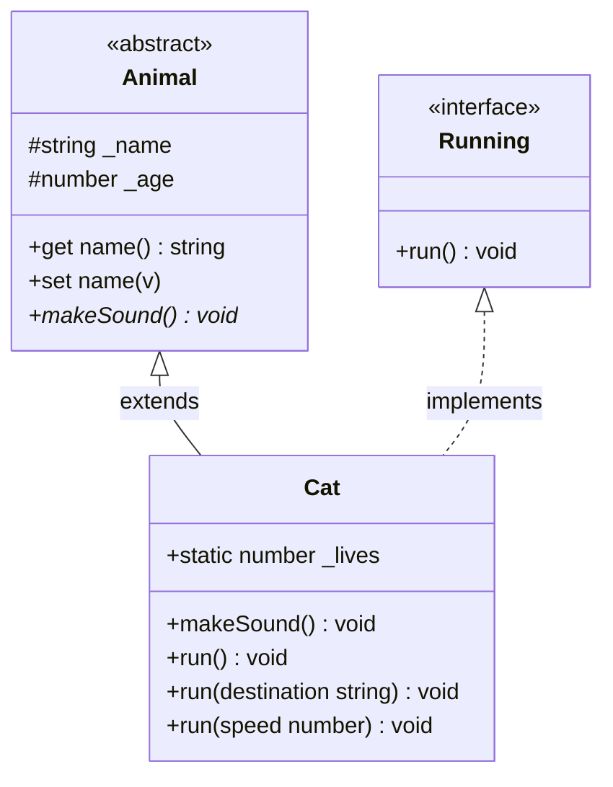

# OOP di TypeScript

**Pemrograman Berorientasi Objek (_Object-Oriented Programming_) di TypeScript.**

---

## Kelas

Kelas adalah blueprint untuk membuat objek. Kelas mendefinisikan atribut (properti) dan perilaku (metode).

```typescript
// model/Animal.ts
class Animal {
  name: string;

  constructor(name: string) {
    this.name = name;
  }

  makeSound(): void {
    console.log(`${this.name} membuat suara`);
  }
}
```

### Struktur Proyek

Mengorganisasi kelas ke dalam file terpisah membuat kode tetap bersih. Klik file mana saja di bawah untuk melihat kodenya:

export const oopFiles = [
  {
    type: "folder",
    name: "src",
    children: [
      {
        type: "file",
        name: "index.ts",
        lang: "typescript",
        code: `import { Cat } from "./model/Cat";

// Member statis — sebelum objek apapun dibuat
console.log(\`Total nyawa: \${Cat._lives}\`); // 9

const cat1 = new Cat(9, "Ginger");
cat1.makeSound(); // "Ginger sedang mengeong"
cat1.run();       // "Ginger sedang berlari"
cat1.run("Sofa"); // "Ginger berlari menuju Sofa"
cat1.run(10);     // "Ginger berlari dengan kecepatan 10"

const cat2 = new Cat(11, "Jumbo");

// Member statis — setelah 2 objek dibuat
console.log(\`Total nyawa: \${Cat._lives}\`); // 11`,
      },
      {
        type: "folder",
        name: "model",
        children: [
          {
            type: "file",
            name: "Animal.ts",
            lang: "typescript",
            code: `export abstract class Animal {
  protected _name: string;
  protected _age: number;
  protected _species: string = "unknown";

  constructor(name: string, age: number = 10, species?: string) {
    this._name = name;
    this._age = age;
    if (species) this._species = species;
  }

  get name(): string { return this._name; }
  get age(): number  { return this._age; }

  set name(v: string) { this._name = v; }
  set age(v: number)  { this._age = v; }

  // Harus diimplementasikan oleh setiap subkelas
  public abstract makeSound(): void;
}`,
          },
          {
            type: "file",
            name: "Cat.ts",
            lang: "typescript",
            code: `import { Animal } from "./Animal";
import { Running } from "./Running";

export class Cat extends Animal implements Running {
  static _lives: number = 9; // dibagi ke semua instansi Cat

  constructor(lives: number, name: string, age: number = 10, species?: string) {
    super(name, age, species); // memanggil constructor Animal
    Cat._lives += 1;
  }

  public makeSound(): void {
    console.log(\`\${this.name} sedang mengeong\`);
  }

  // Signature overload
  public run(): void;
  public run(destination: string): void;
  public run(speed: number): void;

  // Satu implementasi yang menangani semua kasus
  public run(input?: number | string): void {
    if (!input) {
      console.log(\`\${this.name} sedang berlari\`);
    } else if (typeof input === "string") {
      console.log(\`\${this.name} berlari menuju \${input}\`);
    } else {
      console.log(\`\${this.name} berlari dengan kecepatan \${input}\`);
    }
  }
}`,
          },
          {
            type: "file",
            name: "Running.ts",
            lang: "typescript",
            code: `export interface Running {
  run(): void;
}`,
          },
        ],
      },
    ],
  },
];

<FileExplorer files={oopFiles} defaultFile="src/model/Animal.ts" height={400} />

---

## Access Modifier

Access modifier mengontrol dari mana sebuah member kelas (atribut atau metode) dapat diakses.

| Modifier    | Dapat Diakses Dari                       |
| ----------- | ---------------------------------------- |
| `public`    | Di mana saja (default)                   |
| `protected` | Di dalam kelas dan subkelasnya           |
| `private`   | Hanya di dalam kelas itu sendiri         |
| `readonly`  | Di mana saja, tapi tidak bisa diubah     |

```typescript
// model/Animal.ts
abstract class Animal {
  protected _name: string; // bisa diakses di kelas + subkelas
  protected _age: number;
  protected _species: string = "unknown";

  constructor(name: string, age: number = 10, species?: string) {
    this._name = name;
    this._age = age;
    if (species) this._species = species;
  }
}
```

---

## Getter & Setter

Getter dan setter memberikan akses terkontrol ke properti private/protected.

```typescript
// model/Animal.ts
get name(): string {
  return this._name;
}

get age(): number {
  return this._age;
}

set name(namaBaru: string) {
  this._name = namaBaru;
}

set age(umurBaru: number) {
  this._age = umurBaru;
}
```

Penggunaan:

```typescript
const animal = new Animal("Devon");
console.log(animal.name); // menggunakan getter
animal.name = "Riccy";    // menggunakan setter
```

---

## Kelas Abstrak

Kelas abstrak tidak bisa diinstansiasi secara langsung — ia berfungsi sebagai dasar bagi kelas-kelas lain. Metode abstrak wajib diimplementasikan oleh subkelas.

```typescript
// model/Animal.ts
abstract class Animal {
  protected _name: string;

  constructor(name: string) {
    this._name = name;
  }

  // Wajib diimplementasikan oleh setiap subkelas
  public abstract makeSound(): void;
}

// ❌ Tidak bisa melakukan ini:
// const animal = new Animal("Devon");
```

> **Kapan digunakan:** Saat kamu ingin memaksa struktur yang sama di beberapa kelas terkait, namun setiap kelas memiliki implementasinya sendiri.

---

## Pewarisan

Sebuah kelas bisa memperluas kelas lain untuk mewarisi properti dan metodenya menggunakan `extends`. Gunakan `super()` untuk memanggil constructor induk.

```typescript
// model/Cat.ts
class Cat extends Animal {
  constructor(lives: number, name: string, age: number = 10, species?: string) {
    super(name, age, species); // memanggil constructor Animal
    Cat._lives += 1;
  }
}
```

---

## Member Statis

Member statis milik **kelas itu sendiri**, bukan milik instansi/objek individual.

```typescript
// model/Cat.ts
class Cat extends Animal {
  static _lives: number = 9; // dibagi ke semua instansi Cat
}

// Sebelum objek Cat apapun dibuat
console.log(`Total nyawa: ${Cat._lives}`); // 9

const cat1 = new Cat(9, "Ginger");
const cat2 = new Cat(11, "Jumbo");

// Setelah 2 objek Cat dibuat
console.log(`Total nyawa: ${Cat._lives}`); // 11
```

> **Catatan:** Akses member statis melalui nama kelas (`Cat._lives`), bukan melalui instansi.

---

## Interface

Interface mendefinisikan sebuah kontrak — setiap kelas yang `implements` interface tersebut wajib menyediakan metode yang ditentukan.

```typescript
// model/Running.ts
interface Running {
  run(): void;
}
```

```typescript
// model/Cat.ts
class Cat extends Animal implements Running {
  // Wajib mengimplementasikan run() karena interface Running
  public run(): void {
    console.log(`${this.name} sedang berlari`);
  }
}
```

> **Interface vs Kelas Abstrak:**
>
> - Interface → mendefinisikan _apa_ yang harus dilakukan kelas (kontrak)
> - Kelas Abstrak → mendefinisikan _apa_ dan bisa menyediakan _implementasi parsial_ (dasar)

---

## Method Overloading

Overloading memungkinkan sebuah metode menerima tipe atau jumlah parameter yang berbeda — dengan perilaku yang berbeda untuk setiap kasus.

```typescript
// model/Cat.ts
class Cat extends Animal implements Running {
  // Signature overload
  public run(): void;
  public run(tujuan: string): void;
  public run(kecepatan: number): void;

  // Satu implementasi yang menangani semua kasus
  public run(input?: number | string): void {
    if (!input) {
      console.log(`${this.name} sedang berlari`);
    } else if (typeof input === "string") {
      console.log(`${this.name} berlari menuju ${input}`);
    } else if (typeof input === "number") {
      console.log(`${this.name} berlari dengan kecepatan ${input}`);
    }
  }
}
```

Penggunaan:

```typescript
cat1.run();        // "Ginger sedang berlari"
cat1.run("Sofa"); // "Ginger berlari menuju Sofa"
cat1.run(10);     // "Ginger berlari dengan kecepatan 10"
```

---

## Method Overriding

Overriding berarti subkelas menyediakan implementasinya sendiri untuk metode yang didefinisikan di kelas induk (abstrak).

```typescript
// model/Animal.ts
public abstract makeSound(): void;

// model/Cat.ts — override:
public makeSound(): void {
  console.log(`${this.name} sedang mengeong`);
}
```

> **Overloading vs Overriding:**
>
> - **Overloading** — nama metode sama, parameter berbeda
> - **Overriding** — nama metode sama, implementasi berbeda (dari induk)

---

## Ringkasan



| Konsep          | Penjelasan Singkat                                        |
| --------------- | --------------------------------------------------------- |
| Kelas           | Blueprint untuk membuat objek                             |
| Access Modifier | `public` / `protected` / `private` / `readonly`          |
| Getter & Setter | Akses terkontrol ke properti                              |
| Kelas Abstrak   | Kelas dasar, tidak bisa diinstansiasi langsung            |
| Pewarisan       | `extends` + `super()`                                    |
| Member Statis   | Milik kelas, bukan milik instansi                         |
| Interface       | Kontrak yang wajib dipenuhi kelas (`implements`)          |
| Overloading     | Nama metode sama, parameter berbeda                       |
| Overriding      | Nama metode sama, implementasi berbeda                    |
