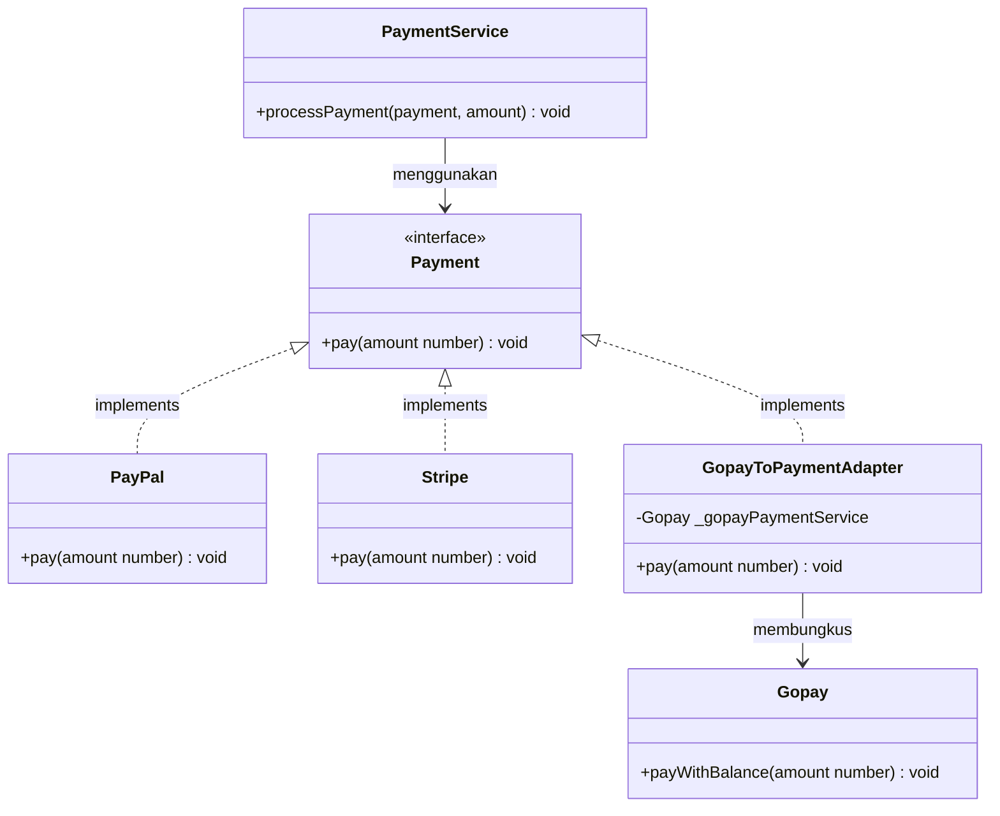
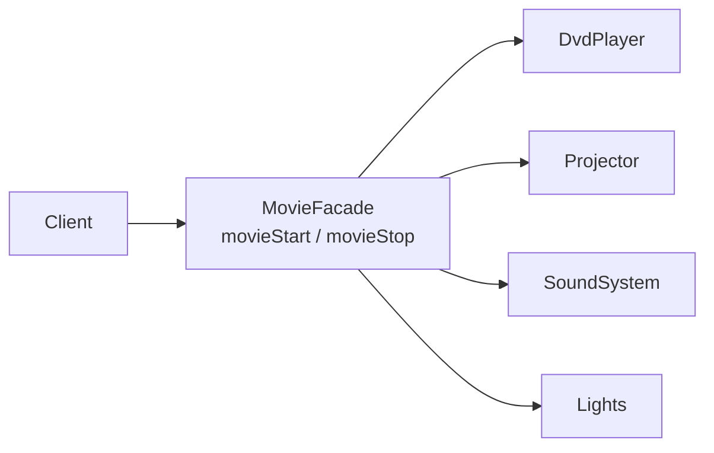

# Structural Design Patterns

**Pattern yang berkaitan dengan bagaimana kelas dan objek disusun untuk membentuk struktur yang lebih besar.**

---

## Adapter

**Membuat dua interface yang tidak kompatibel bisa bekerja bersama — tanpa mengubah salah satunya.**

### 4 Peran Utama

| Peran                | Deskripsi                                                  | Contoh                  |
| -------------------- | ---------------------------------------------------------- | ----------------------- |
| **Client**           | Proyek yang membutuhkan tipe tertentu                      | `PaymentService`        |
| **Target Interface** | Interface yang diharapkan oleh Client                      | `Payment`               |
| **Adaptee**          | Kelas yang sudah ada dan tidak cocok dengan interface-nya  | `Gopay`                 |
| **Adapter**          | Jembatan yang menghubungkan Adaptee ke Client              | `GopayToPaymentAdapter` |

`PaymentService` hanya menerima objek yang mengimplementasikan `Payment` (dengan method `pay()`). PayPal dan Stripe tidak masalah — tapi Gopay menggunakan method yang sama sekali berbeda: `payWithBalance()`.

export const adapterFiles = [
  {
    type: "folder",
    name: "src",
    children: [
      {
        type: "folder",
        name: "problem1-adapter",
        children: [
          {
            type: "folder",
            name: "model",
            children: [
              {
                type: "file",
                name: "payment.ts",
                lang: "typescript",
                code: `export interface Payment {
  pay(amount: number): void;
}`,
              },
              {
                type: "file",
                name: "paypal.ts",
                lang: "typescript",
                code: `import { Payment } from "./payment";

export class PayPal implements Payment {
  public pay(amount: number): void {
    console.log(\`Paid \${amount} using PayPal.\`);
  }
}`,
              },
              {
                type: "file",
                name: "stripe.ts",
                lang: "typescript",
                code: `import { Payment } from "./payment";

export class Stripe implements Payment {
  public pay(amount: number): void {
    console.log(\`Charged \${amount} using Stripe.\`);
  }
}`,
              },
              {
                type: "file",
                name: "gopay.ts",
                lang: "typescript",
                code: `export class Gopay {
  public payWithBalance(amount: number) {
    console.log(\`Balance withdraw \${amount} from gopay\`);
  }
}`,
              },
            ],
          },
          {
            type: "folder",
            name: "adapter",
            children: [
              {
                type: "file",
                name: "GopayToPayment.new.ts",
                lang: "typescript",
                code: `// Adapter
// 1. Menyimpan object Adaptee sebagai attribute
// 2. Implementasi / extend target interface

import { Gopay } from "../model/gopay";
import { Payment } from "../model/payment";

export class GopayToPaymentAdapter implements Payment {
  private _gopayPaymentService: Gopay;

  constructor(gopayPaymentService: Gopay) {
    this._gopayPaymentService = gopayPaymentService;
  }

  pay(amount: number): void {
    this._gopayPaymentService.payWithBalance(amount);
  }
}`,
              },
            ],
          },
          {
            type: "folder",
            name: "service",
            children: [
              {
                type: "file",
                name: "paymentService.ts",
                lang: "typescript",
                code: `import { Payment } from "../model/payment";

export class PaymentService {
  public processPayment(payment: Payment, amount: number) {
    payment.pay(amount);
  }
}`,
              },
            ],
          },
          {
            type: "file",
            name: "demo.ts",
            lang: "typescript",
            code: `import { Gopay } from "./model/gopay";
import { PaymentService } from "./service/paymentService";
import { PayPal } from "./model/paypal";
import { Stripe } from "./model/stripe";
import { GopayToPaymentAdapter } from "./adapter/GopayToPayment.new";

export function runProblem1() {
  const paymentService: PaymentService = new PaymentService();

  console.log("===TESTING PAYMENT METHOD===");
  paymentService.processPayment(new PayPal(), 1000000);
  paymentService.processPayment(new Stripe(), 1000000);
  paymentService.processPayment(
    new GopayToPaymentAdapter(new Gopay()),
    1000000,
  ); // Incompatible interface — diselesaikan lewat Adapter

  // Request -> make new payment method works without changing the legacy and the new payment code
}`,
          },
        ],
      },
    ],
  },
];

<FileExplorer files={adapterFiles} defaultFile="src/problem1-adapter/adapter/GopayToPayment.new.ts" height={420} />

<DiffBlock
  lang="typescript"
  beforeTitle="Masalah — Interface tidak kompatibel"
  afterTitle="Solusi — Adapter menjembatani keduanya"
  before={`// model/gopay.ts — Adaptee yang tidak kompatibel
export class Gopay {
  public payWithBalance(amount: number) {
    console.log(\`Balance withdraw \${amount} from gopay\`);
  }
}

// ❌ Gopay tidak bisa langsung dipakai — nama method berbeda
const paymentService = new PaymentService();
paymentService.processPayment(new Gopay(), 1000000); // type error`}
  after={`// adapter/GopayToPayment.new.ts
// 1. Simpan object Adaptee sebagai attribute
// 2. Implementasi target interface

import { Gopay } from "../model/gopay";
import { Payment } from "../model/payment";

export class GopayToPaymentAdapter implements Payment {
  private _gopayPaymentService: Gopay;

  constructor(gopayPaymentService: Gopay) {
    this._gopayPaymentService = gopayPaymentService;
  }

  pay(amount: number): void {
    this._gopayPaymentService.payWithBalance(amount); // terjemahkan
  }
}

// ✅ Sekarang Gopay bisa dipakai lewat Adapter
const paymentService = new PaymentService();
paymentService.processPayment(new PayPal(), 1000000);   // native
paymentService.processPayment(new Stripe(), 1000000);   // native
paymentService.processPayment(
  new GopayToPaymentAdapter(new Gopay()),
  1000000  // via adapter
);`}
/>

> **Aturan utama:** Baik Client (`PaymentService`) maupun Adaptee (`Gopay`) tidak perlu diubah. Adapter menangani semuanya di antara mereka.

### Kapan Digunakan

- Kamu ingin menggunakan kelas atau library yang ada, tapi interface-nya tidak cocok dengan proyekmu
- Kamu tidak bisa memodifikasi kelas aslinya (misal: library pihak ketiga)
- Kamu perlu membuat beberapa kelas yang tidak kompatibel bekerja dengan interface yang sama

---

## Facade

**Menyediakan interface yang disederhanakan untuk sebuah subsistem yang kompleks.**

Sebuah home theater memiliki banyak komponen — masing-masing dengan method-nya sendiri. Client harus mengatur dan membongkar semuanya secara manual dengan urutan yang benar.

export const facadeFiles = [
  {
    type: "folder",
    name: "src",
    children: [
      {
        type: "folder",
        name: "problem2-facade",
        children: [
          {
            type: "folder",
            name: "model",
            children: [
              {
                type: "file",
                name: "dvdPlayer.ts",
                lang: "typescript",
                code: `export class DvdPlayer {
  public on()  { console.log("DVD Player ON"); }
  public play(movie: string) { console.log(\`Playing movie: \${movie}\`); }
  public stop() { console.log("DVD Player: STOP"); }
  public off() { console.log("DVD Player OFF"); }
}`,
              },
              {
                type: "file",
                name: "projector.ts",
                lang: "typescript",
                code: `export class Projector {
  public on()  { console.log("Projector ON"); }
  public off() { console.log("Projector OFF"); }
  public wideScreenMode() {
    console.log("Projector: set to widescreen mode (16x9)");
  }
}`,
              },
              {
                type: "file",
                name: "soundSystem.ts",
                lang: "typescript",
                code: `export class SoundSystem {
  public on()  { console.log("Sound System ON"); }
  public setVolume(level: number) { console.log(\`Volume set to \${level}\`); }
  public off() { console.log("Sound System OFF"); }
}`,
              },
              {
                type: "file",
                name: "lights.ts",
                lang: "typescript",
                code: `export class Lights {
  dim(level: number) { console.log(\`Lights dimmed to \${level}%\`); }
  on() { console.log("Lights ON"); }
}`,
              },
            ],
          },
          {
            type: "folder",
            name: "facade",
            children: [
              {
                type: "file",
                name: "MovieFacade.new.ts",
                lang: "typescript",
                code: `// Facade
// 1. Attribute: object yang digunakan
// 2. Methods: function yang dibutuhkan

import { DvdPlayer }   from "../model/dvdPlayer";
import { Lights }      from "../model/lights";
import { Projector }   from "../model/projector";
import { SoundSystem } from "../model/soundSystem";

export class MovieFacade {
  private _dvd: DvdPlayer;
  private _projector: Projector;
  private _sound: SoundSystem;
  private _lights: Lights;

  constructor() {
    this._dvd       = new DvdPlayer();
    this._projector = new Projector();
    this._sound     = new SoundSystem();
    this._lights    = new Lights();
  }

  public movieStart() {
    this._lights.dim(30);
    this._projector.on();
    this._projector.wideScreenMode();
    this._sound.on();
    this._sound.setVolume(70);
    this._dvd.on();
    this._dvd.play("Inception");
  }

  public movieStop() {
    this._dvd.stop();
    this._dvd.off();
    this._sound.off();
    this._projector.off();
    this._lights.on();
  }
}`,
              },
            ],
          },
          {
            type: "file",
            name: "demo.before.ts",
            lang: "typescript",
            code: `import { DvdPlayer }   from "./model/dvdPlayer";
import { Lights }      from "./model/lights";
import { Projector }   from "./model/projector";
import { SoundSystem } from "./model/soundSystem";

export function runProblem2() {
  console.log("Get ready to watch a movie!");

  const dvd       = new DvdPlayer();
  const projector = new Projector();
  const sound     = new SoundSystem();
  const lights    = new Lights();

  // The client must know the exact setup sequence
  lights.dim(30);
  projector.on();
  projector.wideScreenMode();
  sound.on();
  sound.setVolume(70);
  dvd.on();
  dvd.play("Inception");

  console.log("Watching movie...");

  // Later, the client must manually turn everything off
  console.log("Movie finished, shutting down system...");
  dvd.stop();
  dvd.off();
  sound.off();
  projector.off();
  lights.on();

  // Request -> make sure client dont directly setup the sequence
}`,
          },
          {
            type: "file",
            name: "demo.ts",
            lang: "typescript",
            code: `import { MovieFacade } from "./facade/MovieFacade.new";

export function runProblem2() {
  console.log("Get ready to watch a movie!");

  const movieFacade = new MovieFacade();
  movieFacade.movieStart();
  console.log("Watching movie...");

  // Later, the client must manually turn everything off
  console.log("Movie finished, shutting down system...");
  movieFacade.movieStop();

  // Request -> make sure client dont directly setup the sequence
}`,
          },
        ],
      },
    ],
  },
];

<FileExplorer files={facadeFiles} defaultFile="src/problem2-facade/facade/MovieFacade.new.ts" height={420} />

<DiffBlock
  lang="typescript"
  beforeTitle="Masalah — Client mengatur segalanya"
  afterTitle="Solusi — Facade menyembunyikan kompleksitas"
  before={`// demo.before.ts — client harus tahu urutan yang tepat
const dvd       = new DvdPlayer();
const projector = new Projector();
const sound     = new SoundSystem();
const lights    = new Lights();

lights.dim(30);
projector.on();
projector.wideScreenMode();
sound.on();
sound.setVolume(70);
dvd.on();
dvd.play("Inception");

console.log("Watching movie...");

dvd.stop();
dvd.off();
sound.off();
projector.off();
lights.on();`}
  after={`// demo.ts — client hanya berbicara dengan Facade
import { MovieFacade } from "./facade/MovieFacade.new";

const movieFacade = new MovieFacade();

movieFacade.movieStart(); // semua setup diurus di dalam
console.log("Watching movie...");

movieFacade.movieStop();  // semua teardown diurus di dalam`}
/>

> **Aturan utama:** Client tidak perlu tahu apa yang terjadi di balik layar. Facade mengurus urutannya.

### Kapan Digunakan

- Sebuah subsistem memiliki banyak kelas dan client harus berinteraksi dengan semuanya
- Kamu ingin menyediakan titik masuk yang bersih dan sederhana ke sistem yang kompleks
- Kamu ingin mengurangi ketergantungan antara client dan internal subsistem

---

## Ringkasan

| Pattern     | Masalah yang Dipecahkan                           | Mekanisme Utama                                                  |
| ----------- | ------------------------------------------------- | ---------------------------------------------------------------- |
| **Adapter** | Interface yang tidak kompatibel antar kelas       | Wrapper class yang menerjemahkan satu interface ke interface lain |
| **Facade**  | Subsistem yang kompleks dengan banyak komponen    | Satu kelas yang mengekspos method tingkat tinggi yang sederhana  |
