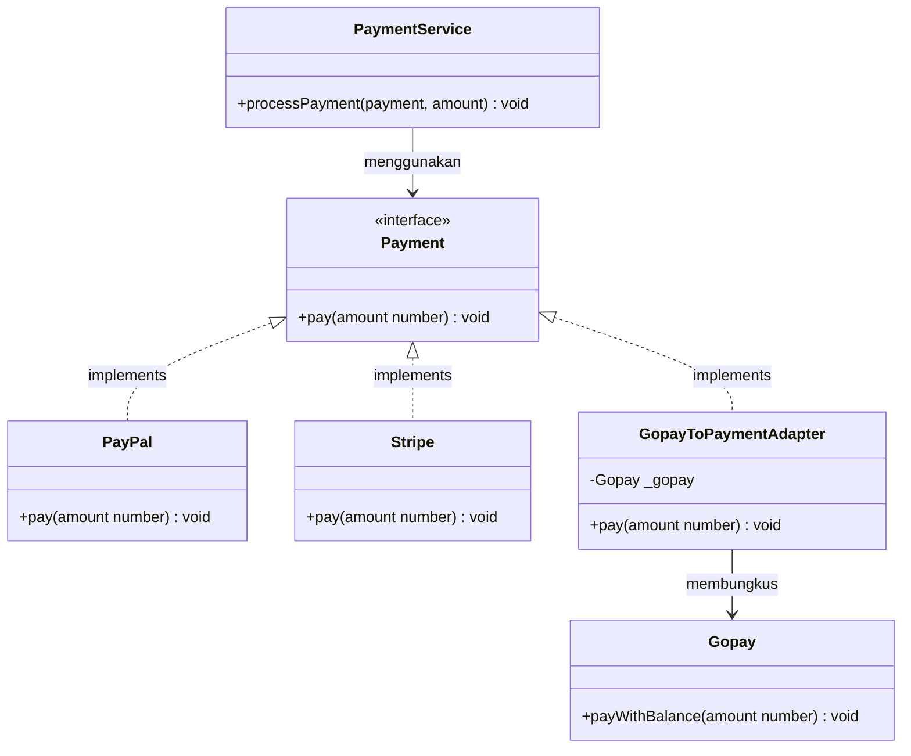
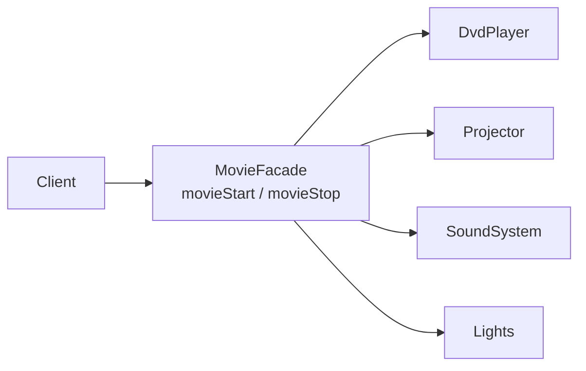

# Structural Design Patterns

**Pattern yang berkaitan dengan bagaimana kelas dan objek disusun untuk membentuk struktur yang lebih besar.**

---

## Adapter

**Membuat dua interface yang tidak kompatibel bisa bekerja bersama — tanpa mengubah salah satunya.**

### 4 Peran Utama

| Peran                | Deskripsi                                                  | Contoh                  |
| -------------------- | ---------------------------------------------------------- | ----------------------- |
| **Client**           | Proyek yang membutuhkan tipe tertentu                      | `PaymentService`        |
| **Target Interface** | Interface yang diharapkan oleh Client                      | `Payment`               |
| **Adaptee**          | Kelas yang sudah ada dan tidak cocok dengan interface-nya  | `Gopay`                 |
| **Adapter**          | Jembatan yang menghubungkan Adaptee ke Client              | `GopayToPaymentAdapter` |

`PaymentService` hanya menerima objek yang mengimplementasikan `Payment` (dengan method `pay()`). PayPal dan Stripe tidak masalah — tapi Gopay menggunakan method yang sama sekali berbeda: `payWithBalance()`.

export const adapterFiles = [
  {
    type: "folder",
    name: "model",
    children: [
      {
        type: "file",
        name: "payment.ts",
        lang: "typescript",
        code: `// Target Interface — yang diharapkan PaymentService
export interface Payment {
  pay(amount: number): void;
}`,
      },
      {
        type: "file",
        name: "paypal.ts",
        lang: "typescript",
        code: `import { Payment } from "./payment";

// Kompatibel — mengimplementasikan Payment
export class PayPal implements Payment {
  public pay(amount: number): void {
    console.log(\`Membayar \${amount} menggunakan PayPal.\`);
  }
}`,
      },
      {
        type: "file",
        name: "stripe.ts",
        lang: "typescript",
        code: `import { Payment } from "./payment";

// Kompatibel — mengimplementasikan Payment
export class Stripe implements Payment {
  public pay(amount: number): void {
    console.log(\`Membayar \${amount} menggunakan Stripe.\`);
  }
}`,
      },
      {
        type: "file",
        name: "gopay.ts",
        lang: "typescript",
        code: `// Tidak kompatibel — menggunakan nama method yang berbeda
export class Gopay {
  public payWithBalance(amount: number) {
    console.log(\`Saldo ditarik \${amount} dari Gopay\`);
  }
}`,
      },
    ],
  },
  {
    type: "folder",
    name: "adapter",
    children: [
      {
        type: "file",
        name: "GopayToPayment.ts",
        lang: "typescript",
        code: `import { Payment } from "../model/payment";
import { Gopay } from "../model/gopay";

export class GopayToPaymentAdapter implements Payment {
  private _gopayPaymentService: Gopay;

  constructor(gopayPaymentService: Gopay) {
    this._gopayPaymentService = gopayPaymentService;
  }

  // Menerjemahkan pay() → payWithBalance() secara internal
  pay(amount: number): void {
    this._gopayPaymentService.payWithBalance(amount);
  }
}`,
      },
    ],
  },
  {
    type: "folder",
    name: "service",
    children: [
      {
        type: "file",
        name: "paymentService.ts",
        lang: "typescript",
        code: `import { Payment } from "../model/payment";

// Client — hanya peduli dengan interface Payment
export class PaymentService {
  public processPayment(payment: Payment, amount: number) {
    payment.pay(amount); // mengharapkan .pay(), bukan .payWithBalance()
  }
}`,
      },
    ],
  },
  {
    type: "file",
    name: "demo.ts",
    lang: "typescript",
    code: `import { PaymentService } from "./service/paymentService";
import { PayPal } from "./model/paypal";
import { Stripe } from "./model/stripe";
import { Gopay } from "./model/gopay";
import { GopayToPaymentAdapter } from "./adapter/GopayToPayment";

const service = new PaymentService();

service.processPayment(new PayPal(), 1000000);  // native
service.processPayment(new Stripe(), 1000000);  // native
service.processPayment(
  new GopayToPaymentAdapter(new Gopay()),
  1000000  // via adapter
);`,
  },
];

<FileExplorer files={adapterFiles} defaultFile="adapter/GopayToPayment.ts" height={380} />

<DiffBlock
  lang="typescript"
  beforeTitle="Masalah — Interface tidak kompatibel"
  afterTitle="Solusi — Adapter menjembatani keduanya"
  before={`// model/gopay.ts — Adaptee yang tidak kompatibel
export class Gopay {
  public payWithBalance(amount: number) {
    console.log(\`Saldo ditarik \${amount} dari Gopay\`);
  }
}

// ❌ Tidak bisa melempar Gopay langsung — nama method salah
const service = new PaymentService();
service.processPayment(new Gopay(), 1000000); // type error`}
  after={`// adapter/GopayToPayment.ts
export class GopayToPaymentAdapter implements Payment {
  private _gopayPaymentService: Gopay;

  constructor(gopayPaymentService: Gopay) {
    this._gopayPaymentService = gopayPaymentService;
  }

  // Menerjemahkan pay() → payWithBalance() secara internal
  pay(amount: number): void {
    this._gopayPaymentService.payWithBalance(amount);
  }
}

// ✅ Sekarang Gopay bisa digunakan lewat Adapter
const service = new PaymentService();
service.processPayment(new PayPal(), 1000000);  // native
service.processPayment(new Stripe(), 1000000);  // native
service.processPayment(
  new GopayToPaymentAdapter(new Gopay()),
  1000000  // via adapter
);`}
/>

> **Aturan utama:** Baik Client (`PaymentService`) maupun Adaptee (`Gopay`) tidak perlu diubah. Adapter menangani semuanya di antara mereka.

### Kapan Digunakan

- Kamu ingin menggunakan kelas atau library yang ada, tapi interface-nya tidak cocok dengan proyekmu
- Kamu tidak bisa memodifikasi kelas aslinya (misal: library pihak ketiga)
- Kamu perlu membuat beberapa kelas yang tidak kompatibel bekerja dengan interface yang sama

---

## Facade

**Menyediakan interface yang disederhanakan untuk sebuah subsistem yang kompleks.**

Sebuah home theater memiliki banyak komponen — masing-masing dengan method-nya sendiri. Client harus mengatur dan membongkar semuanya secara manual dengan urutan yang benar.

export const facadeFiles = [
  {
    type: "folder",
    name: "subsystem",
    children: [
      {
        type: "file",
        name: "DvdPlayer.ts",
        lang: "typescript",
        code: `export class DvdPlayer {
  public on(): void  { console.log("DVD Player menyala"); }
  public off(): void { console.log("DVD Player mati"); }

  public play(movie: string): void {
    console.log(\`Memutar film: \${movie}\`);
  }

  public stop(): void { console.log("DVD Player berhenti"); }
}`,
      },
      {
        type: "file",
        name: "Projector.ts",
        lang: "typescript",
        code: `export class Projector {
  public on(): void { console.log("Proyektor menyala"); }
  public off(): void { console.log("Proyektor mati"); }

  public wideScreenMode(): void {
    console.log("Proyektor: mode layar lebar");
  }
}`,
      },
      {
        type: "file",
        name: "SoundSystem.ts",
        lang: "typescript",
        code: `export class SoundSystem {
  public on(): void  { console.log("Sistem suara menyala"); }
  public off(): void { console.log("Sistem suara mati"); }

  public setVolume(level: number): void {
    console.log(\`Volume diatur ke \${level}\`);
  }
}`,
      },
      {
        type: "file",
        name: "Lights.ts",
        lang: "typescript",
        code: `export class Lights {
  public on(): void  { console.log("Lampu menyala penuh"); }

  public dim(level: number): void {
    console.log(\`Lampu diredupkan ke \${level}%\`);
  }
}`,
      },
    ],
  },
  {
    type: "folder",
    name: "facade",
    children: [
      {
        type: "file",
        name: "MovieFacade.ts",
        lang: "typescript",
        code: `import { DvdPlayer }   from "../subsystem/DvdPlayer";
import { Projector }   from "../subsystem/Projector";
import { SoundSystem } from "../subsystem/SoundSystem";
import { Lights }      from "../subsystem/Lights";

export class MovieFacade {
  private _dvd: DvdPlayer;
  private _projector: Projector;
  private _sound: SoundSystem;
  private _lights: Lights;

  constructor() {
    this._dvd       = new DvdPlayer();
    this._projector = new Projector();
    this._sound     = new SoundSystem();
    this._lights    = new Lights();
  }

  public movieStart(): void {
    this._lights.dim(30);
    this._projector.on();
    this._projector.wideScreenMode();
    this._sound.on();
    this._sound.setVolume(70);
    this._dvd.on();
    this._dvd.play("Inception");
  }

  public movieStop(): void {
    this._dvd.stop();
    this._dvd.off();
    this._sound.off();
    this._projector.off();
    this._lights.on();
  }
}`,
      },
    ],
  },
  {
    type: "file",
    name: "demo.ts",
    lang: "typescript",
    code: `import { MovieFacade } from "./facade/MovieFacade";

const movieFacade = new MovieFacade();

// Client hanya berbicara dengan Facade
movieFacade.movieStart(); // menangani semua setup secara internal
console.log("Menonton film...");

movieFacade.movieStop(); // menangani semua pembongkaran secara internal`,
  },
];

<FileExplorer files={facadeFiles} defaultFile="facade/MovieFacade.ts" height={400} />

<DiffBlock
  lang="typescript"
  beforeTitle="Masalah — Client mengatur segalanya"
  afterTitle="Solusi — Facade menyembunyikan kompleksitas"
  before={`const dvd       = new DvdPlayer();
const projector = new Projector();
const sound     = new SoundSystem();
const lights    = new Lights();

// Hanya untuk memulai film...
lights.dim(30);
projector.on();
projector.wideScreenMode();
sound.on();
sound.setVolume(70);
dvd.on();
dvd.play("Inception");

// Dan untuk menghentikannya...
dvd.stop();
dvd.off();
sound.off();
projector.off();
lights.on();`}
  after={`export class MovieFacade {
  private _dvd: DvdPlayer;
  private _projector: Projector;
  private _sound: SoundSystem;
  private _lights: Lights;

  constructor() {
    this._dvd       = new DvdPlayer();
    this._projector = new Projector();
    this._sound     = new SoundSystem();
    this._lights    = new Lights();
  }

  public movieStart(): void {
    this._lights.dim(30);
    this._projector.on();
    this._projector.wideScreenMode();
    this._sound.on();
    this._sound.setVolume(70);
    this._dvd.on();
    this._dvd.play("Inception");
  }

  public movieStop(): void {
    this._dvd.stop();
    this._dvd.off();
    this._sound.off();
    this._projector.off();
    this._lights.on();
  }
}

// Client hanya berbicara dengan Facade
const movieFacade = new MovieFacade();
movieFacade.movieStart(); // menangani semua setup secara internal
movieFacade.movieStop();  // menangani semua pembongkaran secara internal`}
/>

> **Aturan utama:** Client tidak perlu tahu apa yang terjadi di balik layar. Facade mengurus urutannya.

### Kapan Digunakan

- Sebuah subsistem memiliki banyak kelas dan client harus berinteraksi dengan semuanya
- Kamu ingin menyediakan titik masuk yang bersih dan sederhana ke sistem yang kompleks
- Kamu ingin mengurangi ketergantungan antara client dan internal subsistem

---

## Ringkasan

| Pattern     | Masalah yang Dipecahkan                           | Mekanisme Utama                                                  |
| ----------- | ------------------------------------------------- | ---------------------------------------------------------------- |
| **Adapter** | Interface yang tidak kompatibel antar kelas       | Wrapper class yang menerjemahkan satu interface ke interface lain |
| **Facade**  | Subsistem yang kompleks dengan banyak komponen    | Satu kelas yang mengekspos method tingkat tinggi yang sederhana  |
