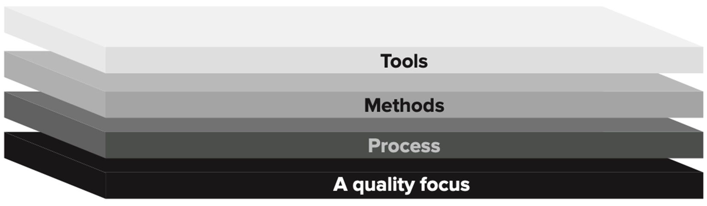

# The Nature of Software and Software Engineering

---

## Software

Software ⇒ sekumpulan perintah atau instruksi (instruction), struktur data (Structure Data), dan dokumentasi (documentation ) yang terstruktur yang menjalankan fungsi atau program dalam komputer. Software mudah digunakan jika lansia atau orang tua mudah dan mengerti.

### Software bisa dikatakan sebagai:

1. **Instructions** yang ketika dieksekusi memberikan features, function dan performance.
2. **Data Structures** yang memungkinkan program untuk memanipulasi informasi secara memadai.
3. **Descriptive Information (Documentation)** dalam bentuk hardcopy atau virtual (softcopy) yang berisi penjelasan cara penggunaan dan cara kerja suatu program.

### Software Application Domain:

1. System Software

- ⇒ Software yang dibuat untuk memberikan service bagi program lain.
- Tidak bekerja langsung untuk user, melainkan membantu hardware dan program lain agar bisa berjalan.
- System Software biasanya sangat kompleks, karena harus mengelola banyak hal sekaligus, seperti mengatur memori dan jadwal kerja processors.
- Contoh: Operation System (Windows, Linux, MacOS), driver hardware (Seperti driver printer)

2. Application software

- ⇒ Software mandiri yang dibuat untuk menyelesaikan kebutuhan bisnis (Business need) atau teknis yang spesifik.
- Tujuannya untuk membantu manusia dalam mengambil keputusan atau memproses data operasional
- Contoh: Adobe Photoshop, Aplikasi kasir

3. Engineering/Scientific Software

- ⇒ Software pengolahan angka atau ilmu data yang mencakupi berbagai bidang.
- Penggunaan Software ini meliputi bidang astronomi, vulkanologi, analisis tegangan otomotif, dinamika orbit, Computer Aided Design (CAD), statistika (contohnya mengukur dan menentukan kebiasaan belanja konsumen), generic analysis, dan meterologi.
- Namun, sekarang fungsinya berkembang ke arah desain interaktif dan simulasi sistem yang lebih canggih
- Contoh: Ansys, NASA, design bangunan dengan CAD, simulasi cuaca, software analysis struktur mobil

4. Embedded software

- ⇒ Software yang berada di dalam suatu hardware untuk mengontrol fungsi dan fitur hardware/alat tersebut.
- Contoh: Pengaturan suhu di microwave, pengeraman otomatis (ABS) pada mobil

5. Product-line software

- ⇒ Software yang dibuat dengan fungsi tertentu dan untuk digunakan berbagai macam customers (user) sekaligus. Ada yang spesifik untuk pasar tertentu (Contoh: inventory control products), ada yang untuk masyarakat luas (seperti word processing, spreadsheets, computer graphics, multimedia, etc.)
- Contoh: Microsoft Office, Autodesk AutoCAD, ORACLE Database

6. Web/mobile applications software

- ⇒ Software yang berpusat pada jaringan internet
- Meliputi beragam aplikasi dan meliputi aplikasi browser-based apps, cloud computing, service-based computing, dan software pada mobile devices
- Contoh: Google, tokopedia, instagram, aplikasi media sosial, platform e-commerce

7. Artificial intelligence software

- ⇒ Software yang meliputi bidang robotika. decision-making system, patter recognition (pola gambar dan suara), machine learning, theorem proving, dan game paying.
- Contoh: Google translate, gemini, chatGPT

---

## Software Engineering

Menurut IEE, Software Engineering ⇒ Penerapan pendekatan yang sistematis, disiplin, dan terukur dalam pengembangan, pengoperasian, dan pemeliharaan software. Jadi, Software Engineering itu adalah cara kita pakai prinsip teknik (engineering) ke dalam dunia software.

### Software Engineering VS Programming

| Aspek                         | Programming                               | Software Engineering                                                                                                                                                                                                                                                                               |
| :---------------------------- | :---------------------------------------- | :------------------------------------------------------------------------------------------------------------------------------------------------------------------------------------------------------------------------------------------------------------------------------------------------- |
| Core idea                     | Hanya mengetik kode                       | Mengetik kode + memelihara kode/software yang sudah dibuat                                                                                                                                                                                                                                         |
| Primary focus                 | Menulis kode agar berfungsi               | Mengembangkan kode ditambah modifikasi, pemeliharaan, dan evolusi                                                                                                                                                                                                                                  |
| Typical activites             | Coding, debugging, refactoring kecil      | Penentuan dan pemenuhan Requirement, architecture/design, coding, testing, CI/CD, documentation, reviews, monitoring, maintenance                                                                                                                                                                  |
| Team Collaboration            | Bisa sendiri atau tim kecil               | Dirancang untuk kerja dalam tim besar. Ada standar, proses, dan shared tooling (tool yang digunakan bersama)                                                                                                                                                                                       |
| Quality attributes emphasized | Fungsionalitas, dan basic correctness     | Maintainability (Kemudahan pemeliharaan),Reliability (Keandalan), Scalability (Skalabilitas), Security (Keamanan), Usability (Kegunaan), Performance (Performa) Deliverable (Hasilnya) Kode / fitur yang berfungsi Produk / layanan yang berfungsi + lifecycle support (update, fixes, operations) |
| Success metric                | Fitur berfungsi atau lulus uji coba / tes | Software tetap berharga, meliputi kriteria: fewer regressions, easier change, stable delivery, biaya terkelola (Manageable cost)                                                                                                                                                                   |

### Software Engineering Layer

**Process** holds everything together → **Methods** tell how to build → **Tools** help you do it faster & consistently → all under a **Quality Focus.**

| Layer           | Pengertian                                        | Hal yang dilakukan                                                                                                                                                                                                                                                        |
| :-------------- | :------------------------------------------------ | :------------------------------------------------------------------------------------------------------------------------------------------------------------------------------------------------------------------------------------------------------------------------ |
| A quality focus | Sebuah komitmen tim/organisasi terhadap kualitas  | 1. Menetapkan prinsip peningkatan proses berkelanjutan (Process Imporvement Principles) pada software,   2. Memberikan integritas (Keamanan software → Data hanya dapat diakses oleh orang yang berwenang),   3. Memfokuskan pada maintainability dan usability |
| Process         | Framework untuk melakukan dan mengelola pekerjaan | Mendefinisikan activites (aktivitas), milestones, roles, dan change contorl untuk memberikan software yang efektif                                                                                                                                                        |
| Methods         | Teknis cara melakukan dalam membangun software    | Memandu komunikasi, requirements, design, coding, testing, dan support (dukungan)                                                                                                                                                                                         |
| Tools           | Support (dukungan) yang otomatis/semi-otomatis    | Membantu menjalankan proses & metode secara efisien, mengintegrasikan workflow (alur kerja) (CASE)                                                                                                                                                                        |

### Vasa Syndrome

Vasa Syndrome ⇒ sebuah konsep (dalam bidang management and engineering) yang menggambarkan kegagalan proyek karena manajemen yang disebabkan oleh komunikasi yang buruk, top-management interference, goals/tujuan yang tidak jelas, dan rushing development (terburu-buru).

Contoh Vasa Syndrom: The Crowdstrike Incident (Juli 2024). **Penyebab**:

| Aspek Kegagalan                      | Kegagalan                                                                                                                                                                                                                                                                                                           |
| :----------------------------------- | :------------------------------------------------------------------------------------------------------------------------------------------------------------------------------------------------------------------------------------------------------------------------------------------------------------------ |
| Requirements (Architecture & Design) | 1. Software CrowdStrike berjalan di tingkat kernel OS (punya akses paling dalam ke sistem). Sehingga, kesalahan sedikit pada tingkat ini bisa mengakibatkan sistem mati total (BSOD / Blue Screen of Death) dan tidak bisa booting. 2. Update Content lebih sering tanpa pengawasan ketat daripada update software. |
| Quality Assurance (QA)               | 1. Kegagalan dalam proses pengujian (file konfigurasi baru/content maupun alat pembaca file tersebut/parser). File yang rusak/tidak valid tetap lolos ke tahap produksi.                                                                                                                                            |
| DevOps                               | 1. Update software tidak dikirim secara bertahap. (Seharusnya bertahap)  2. Perbaikan tidak dapat dilakukan melalui jarak jauh (internet) karena komputer yang terdampak ada di siklus BSOD.                                                                                                                   |
| Metrics                              | 1. Skewed incentives. Ada tekanan untuk merilis fitur baru dan update secepatnya dan terkadang mengabaikan faktor keamanan                                                                                                                                                                                          |
| Licenses                             | 1. Tanggung jawab terbatas. Risiko kerugian finansial akibat masalah ini lebih banyak ditanggung oleh user/perusahaan klien daripada pengembang/developer.                                                                                                                                                          |
